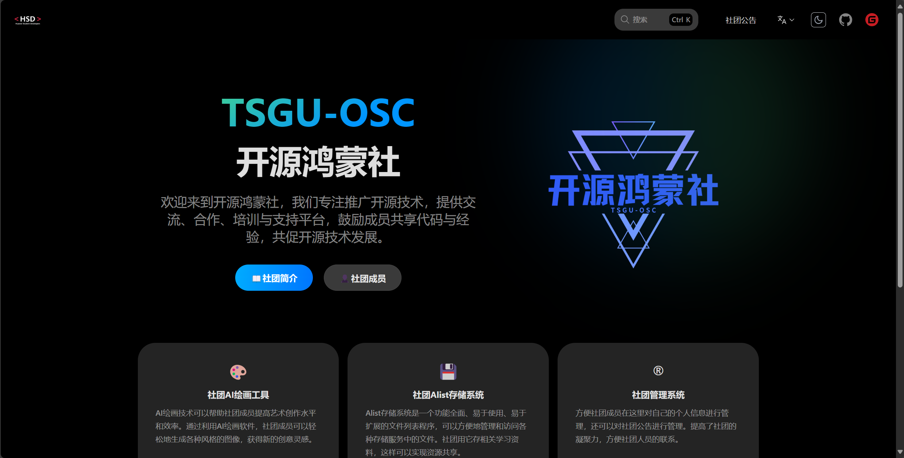
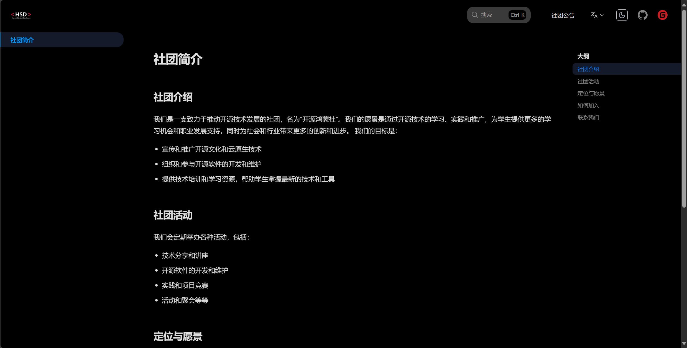
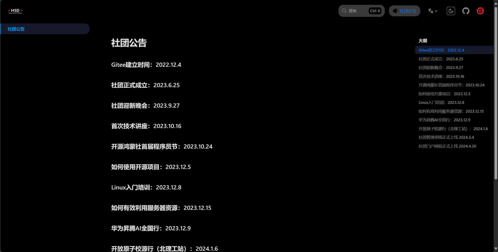
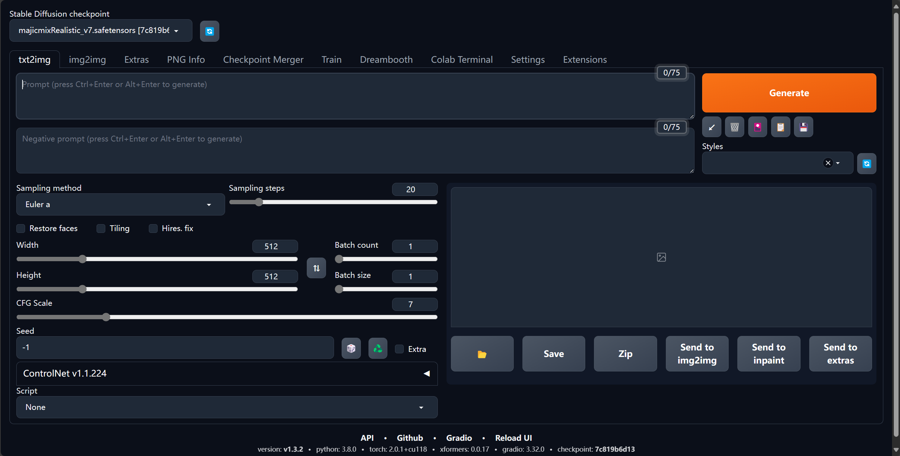
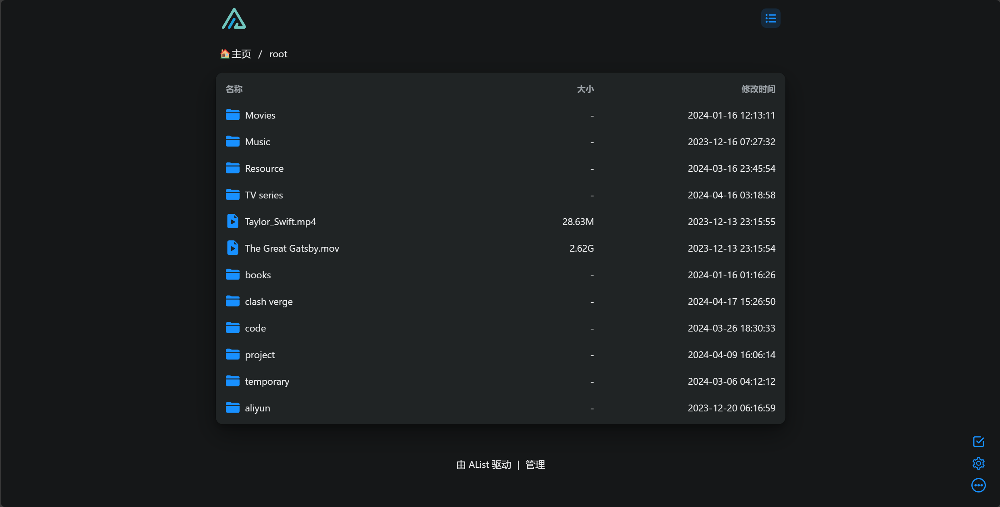
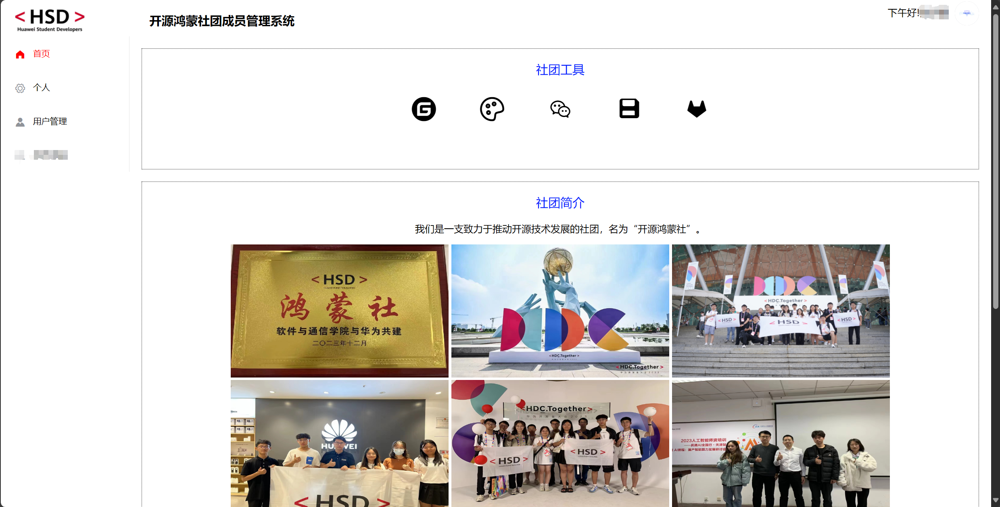

# 社团门户网站仓库介绍
## 一、仓库介绍
📢 社团门户网站是一个基于Rspress框架的网站，用于展示社团的基本信息以及社团的公告等。

- 网站地址：https://osc.tsguas.cn/
- 预览：

## 二、主要内容

### 1. 主要功能

🌟 社团门户网站主要实现了社团简介、社团成员、社团公告的展示，方便扩大社团影响力。

- **社团简介**：

- **社团成员**：

- **社团公告**：

- **社团AI绘画工具**：AI绘画技术可以帮助社团成员提高艺术创作水平和效率。通过利用AI绘画软件，社团成员可以轻松地生成各种风格的图像，获得新的创意灵感。

- **社团Alist存储系统**：Alist存储系统是一个功能全面、易于使用、易于扩展的文件列表程序，可以方便地管理和访问各种存储服务中的文件。社团用它存相关学习资料，这样可以实现资源共享。

- **社团管理系统**：方便社团成员在这里对自己的个人信息进行管理，还可以对社团公告进行管理。提高了社团的凝聚力，方便社团人员的联系。

- **社团活动文章**：社团门户网站会将社团主要活动展示在上面以便社团成员观看。

### 2. 技术栈
📖 该社团门户网站主要采用了以下技术栈：

前端框架：Rspress框架
这些技术栈都是目前较为流行和广泛使用的技术，具有成熟稳定、高效安全的特点。通过这些技术栈的结合使用，可以构建出功能强大、性能卓越的Web应用。

如果对Rspress框架有兴趣的话，请访问：https://rspress.dev/zh/