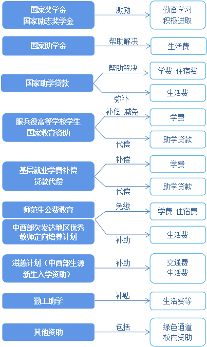

# Funding policy

The new semester is coming soon, and prospective college students are also preparing for their upcoming college life. If your family is facing financial difficulties, don't worry. The government has established a comprehensive system of student aid policies for higher education, including national scholarships, national motivational scholarships, national grants, and national student loans, which can help you smoothly enroll and complete your studies!

## Autonomous Policy System for College Students

### 1. National Scholarship for Undergraduate and Junior College Students
Special outstanding full-time undergraduate and junior college students (including vocational colleges and second bachelor's degrees) included in the national enrollment plan will be rewarded, with 60000 students awarded annually at a rate of 8000 yuan per student, and a nationally printed certificate of honor will be issued.

### 2. National Inspirational Scholarship for Undergraduate and Junior College Students
Reward full-time undergraduate and junior college students (including vocational and second bachelor's degrees) from economically disadvantaged families who are included in the national enrollment plan for both academic and moral excellence, with an annual fee of 5000 yuan per student.

### 3. National Scholarship for Undergraduate and Vocational Students
The average subsidy standard for full-time undergraduate and vocational students from economically disadvantaged families (including preparatory, vocational, and second bachelor's degree students, excluding retired soldier students) included in the national enrollment plan is 3300 yuan per student per year. The specific standard is determined by universities within the range of 2000-4500 yuan per student per year and can be divided into 2-3 levels. Full time retired soldier students on campus are entitled to the national scholarship for undergraduate and junior college students, with a subsidy standard of 3300 yuan per student per year.

### 4. National student loans
National student loans are credit loans provided by the government and financial institutions to economically disadvantaged students in universities. They are prioritized for paying tuition and accommodation fees during their school years, and any excess can be used to cover daily living expenses. The maximum amount per person per year is 16000 yuan, and the interest during their school years is borne by the state. The term of the student loan is 15 years after the school system, with a maximum of 22 years. The interest rate for student loans shall be calculated by subtracting 60 basis points from the market quoted interest rate (LPR) for loans of the same period and grade. The national student loan is divided into the student origin credit loan and the campus national student loan. Students with loan needs can consult with the student aid management department of the county (city, district, flag) where their registered residence is located to apply for the student origin credit loan, or consult with the student aid management department of the university to apply for the campus national student loan. Borrowed students cannot apply for both local credit student loans and campus national student loans simultaneously within the same academic year.

### 5. National Education Funding for Military Service Higher Education Students
For college students who are conscripted for compulsory military service and recruited as non commissioned officers (formerly non commissioned officers), a one-time compensation for the tuition fees paid during their school years or compensation for the national student loan used for tuition fees will be provided upon enlistment; Students who are currently studying in higher education institutions (including new students admitted according to national enrollment regulations) before being conscripted for military service, and who retain their student status or admission qualifications during their service period in accordance with relevant national regulations, and voluntarily return to school or enroll after retirement, will be eligible for tuition fee reduction; For newly enrolled students who have retired and are employed independently, and have been admitted to higher education institutions through the national unified college entrance examination or vocational classification recruitment method and registered on campus, tuition fees will be waived. The amount of tuition compensation or national student loan compensation shall be based on the higher of the actual tuition paid by the student or the national student loan used for tuition (including the principal and interest generated before full repayment); The amount of tuition fee reduction after resuming or enrolling new students shall be based on the actual tuition fee charged by the higher education institution. The standards for tuition compensation, national student loan compensation, and tuition fee reduction shall not exceed 16000 yuan per student per year. Any amount exceeding the standard shall not be compensated, compensated, or reduced.

### 6. Compensation for tuition fees and loans for grassroots employment
Fresh graduates from central universities who voluntarily work in grassroots units below the county level (excluding county-level areas) in the central and western regions, difficult and remote areas, and old industrial bases, with a service period of more than 3 years (including 3 years), shall be compensated for tuition fees or national student loans used for tuition fees (including principal and interest generated before full repayment), with a maximum of 16000 yuan per student per year. The compensation for tuition fees and loans for graduates from local universities shall be formulated and implemented by each region in accordance with central policies.

### 7. Targeted Training Program for Outstanding Teachers in Underdeveloped Regions of Central and Western China through Public funded Education for Normal Students
Public funded normal students from six directly affiliated normal universities under the Ministry of Education, including Beijing Normal University, East China Normal University, Northeast Normal University, Central China Normal University, Shaanxi Normal University, and Southwest University, as well as teacher students from the Outstanding Teacher Targeted Training Program (referred to as the "Excellent Teacher Program") in underdeveloped areas of central and western China, do not need to pay tuition fees or accommodation fees during their studies and can also receive living expenses subsidies. Outstanding students who aspire to teach and meet the requirements of non teacher education majors can transfer to publicly funded teacher education majors within two years of enrollment according to regulations. The university will refund tuition fees, accommodation fees, and reissue living allowance subsidies. Students who intend to apply for local government funded teacher training programs, as well as those enrolled in the "Excellent Teacher Program" teacher training programs offered by local teacher training colleges, can consult relevant colleges for specific information.

### 8. Central Special Lottery Public Welfare Fund Education Assistance Project Zihui Plan (formerly known as New Student Enrollment Assistance Project)
The Ministry of Finance and the Ministry of Education have entrusted the China Education Development Foundation to carry out the specific implementation. New students from economically disadvantaged families in the central and western regions can apply for admission assistance programs, which provide a one-time subsidy for their transportation expenses between their home location and the admitted institution, as well as short-term living expenses after enrollment. Students can consult with the local county-level education department for assistance.
The central and western regions include: Hebei Province, Shanxi Province, Inner Mongolia Autonomous Region, Jilin Province, Heilongjiang Province, Anhui Province, Jiangxi Province, Henan Province, Hubei Province, Hunan Province, Guangxi Zhuang Autonomous Region, Hainan Province, Chongqing City, Sichuan Province, Guizhou Province, Yunnan Province, Xizang Autonomous Region, Shaanxi Province, Gansu Province, Ningxia Hui Autonomous Region, Qinghai Province, Xinjiang Uygur Autonomous Region, Xinjiang Production and Construction Corps.

### 9. Work study program
College students can participate in work study programs organized by universities during their spare time, as long as they have spare time, to obtain legal remuneration through labor and improve their learning and living conditions.

### 10. Green channel
New students from economically disadvantaged families who are unable to temporarily raise tuition and accommodation fees can apply for admission through the "green channel" provided by universities when reporting for the start of the semester. After enrollment, the university student financial aid management department will carry out the identification of economically disadvantaged students based on their specific situation and take different measures to provide financial aid.

### 11. On campus funding
The school uses its operating income to extract funds and social donations to establish on campus support programs such as scholarships, grants, hardship allowances, meal subsidies, interest free loans, and tuition waivers.

## Kind Reminder
To apply for recognition as a financially disadvantaged student, you need to fill out an application form. This form can be downloaded from the "Policy Documents - Comprehensive Policies" section of the National Student Financial Assistance Management Center website. It does not require a seal, but requires a personal commitment and signature. We hope you will be honest, trustworthy, and truthfully fill out the form. If you are a student who was originally registered, receiving subsistence allowances, being supported by the extremely poor, or from other economically disadvantaged families, remember to bring copies of relevant materials.
[National Student Financial Assistance Management Center Website](https://www.xszz.edu.cn/)

## Security Warning
Before and after the start of school, there is often a high incidence of telecommunications and Internet fraud. Some fraudsters will impersonate university teachers, staff of funding institutions, etc., send text messages, call new students, add WeChat or QQ friends, use various means to defraud money, or issue Internet consumer loans, and induce students to participate in various skills training through non-performing loans such as "learning before paying" and "interest free installment", so that students fall into the trap of high-value loans. Please keep your eyes open, be vigilant, resist temptation, and avoid being deceived.
