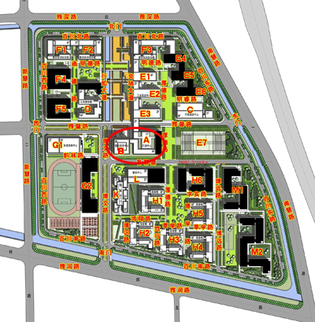

# 图书馆简介 
1984年，建立天津企业管理培训中心图书室；1986年，建立天津中德现代技术培训中心工会图书室；2009年12月，伴随着原天津企业管理培训中心与天津中德现代技术培训中心的重组与合并成立天津中德职业技术学院，建立天津中德职业技术学院图书馆；2011年4月，学校整体迁入天津海河教育园区新校区，建立天津中德职业技术学院图文信息中心，包括图书馆、档案馆和网络信息中心；2015年11月，依据《关于教育部同意建立天津中德应用技术大学的函》，学校更名天津中德应用技术大学，建立天津中德应用技术大学图书馆；2016年，相继完成了学校各教育教学学院图书馆分馆建设并实现了与学校图书馆集成管理系统的对接及在统一的平台上为读者提供特色服务；2017年11月，天津教育工作重点中指出：“支持天津中德应用技术大学建设世界一流应用技术大学”，面对历史发展机遇，图书馆秉承“一切为了读者”的服务理念，坚持内涵式发展，注重服务创新及综合服务能力的全面提升，截止2020年7月，图书馆建筑面积约1万平方米，阅览座位千余席，每周开馆服务时间90小时，无线网络覆盖全馆，实现了开放式借阅一体化服务格局；在典藏文献中，中外文纸质图书80余万册、中外文纸质期刊近三百余种、中文报纸百余种以及丰富的中外文数字化文献资源，形成了基本覆盖学校全学科、类型丰富的综合性文献典藏体系。
    图书馆作为校园文化中心、信息中心和学习中心，紧跟世界一流应用技术大学建设步伐，正在努力成为传承文明、滋润心灵、博学专精的圣殿，成为助力学校建设和发展的智力支撑与保障。

### 地理位置
- 天津中德应用技术大学图书馆位于学院B座，如下图所示。  

## 开放楼层和时间
| 开放楼层 | 馆名 | 开放时间 | 注意事项 |
| :---: | --- | --- | --- |
| 二楼、三楼、六楼 | 自主学习空间 | 每周一至周日7:30a.m-22:00p.m | 二楼、三楼、六楼 每日 21:20 闭馆提示; 21:30 完成清场; 21:30 以后各楼层进行图书上架、整架、阅览室整理与安全检查: 22 点整闭馆 |
| 二楼、三楼、四楼 | 耕读天地 | 每周一至周五8:30a.m-22:00p.m | 四楼、五楼、六楼: 每日 20:30 停止图书借阅; 20:30 以后进行期刊上架、下架、过刊典藏及阅览室整理与安全检查 |
| 四楼 | 文社馆 | 每周一至周五8:30a.m-22:00p.m | 同上 |
| 五楼 | 科技馆 | 每周一至周五8:30a.m-22:00p.m | 同上 |
| 五楼 | 国学阅览室&学生小组讨论室 | 每周一至周五8:30a.m-22:00p.m | 同上 |
| 五楼 | 专业馆 | 每周一至周五8:30a.m-22:00p.m | 同上 |
| 六楼 | 教师研修室&学生小组讨论室 | 每周一至周五8:30a.m-22:00p.m | 同上 |

## 入馆需知
1. 校内读者凭本人校园卡、图书证或学生证入馆，严禁借用他人证件；校外读者凭介绍信及本人有效证件与图书馆办公室联系后方可入馆。

2. 保持图书馆安静，禁止在馆内大声喧哗或朗读。入馆后请将手机关闭或调至震动档。

3. 严禁在图书馆内任何地方吸烟，一经发现视情节轻重，处以100元以上罚款，或送交学院安全保卫处。

4. 保持馆内清洁卫生，禁止在阅览区内吃东西、饮用有色饮料、随地吐痰、乱丢垃圾。

5. 图书是国家财产，读者要自觉爱护。不得在书内批注、圈点、勾划、更不得撕剪、折页，若有遗失、损坏，按《天津中德应用技术大学图书馆关于书刊赔偿与逾期罚款规定》处理。

6. 离馆时请带走所有物品，不得用书本、书包等占座位，不得随意挪动阅览桌椅。

7. 进入图书馆言谈举止要文明大方，衣装整齐，不得穿拖鞋、钉鞋及过度暴露的服装入馆。

8. 文社与专业馆不允许携带任何箱包、提带入内。进入前请将书包放在存包柜，并管理好自己的财物，以免丢失；携带笔记本电脑包的读者，请将电脑取出，将电脑包放置在存包柜；携带塑料袋、手提袋的读者，请将其中所需物品拿出，塑料袋、手提袋放置在存包柜；在借状态的馆藏图书不得带入馆内。

9. 自觉遵守本馆的各项规章制度，支持工作人员按章办事。

10. 对违反上述规定者，任何人都有权进行制止和批评，情节严重者由图书馆会同有关部门予以协商处理。

##   借阅须知
1. 选书时，应自觉保持图书架位排列顺序，不得乱取乱放。每次限取图书2册，阅毕请将图书就近放入还书箱内。
2. 需要借阅的图书必须在本楼层办理借
阅手续方可带出.
3. 借阅图书一律凭本人借书证，不准转借、代借：如违反规定，一切后果由该借阅证持有人负责。
4. 工具书、特色馆藏、外文图书、报纸、
期刊和教师阅览室书籍概不外借。
5. 办理借阅手续前，请仔细查看所借图书是否完好无损（包括光盘、手册等附件）。若发现有残破、污损、遗失等情况，应当立即向工作人员说明。否则，还书时发现残破、污损、附件丢失等情况，由读者本人负责。部分随书光盘可通过条码扫描进行外借，该部分随书光盘一旦借出视同单册书籍，一旦发生损坏、丢失，按照《天津中德职业技术学院图书馆关于书刊赔偿与借阅过期罚款规定》进行赔偿,
6. 请自觉爱护图书。对污损、撕割图书或未办借阅手续
带出图书馆者，视情节轻重，按有关规定给予处罚。jieyuetongze

## 借阅通则
1. 进入书库必须出示本人借阅证，无本人借阅证不准入内，若发现使用他人借阅证则将证扣留。

2. 外借书库的进口、出口都在各楼借还处。

3. 借书前先查看本馆《馆藏布局》，对读者开放的区域包括四楼文社馆、五楼专业馆、三楼自习区，其中工具书库、期刊、报纸馆藏不准借出馆外，只能在本馆阅览。

4. 进书库阅览每人限选图书2册，并阅览后的图书放入还书箱内，如需外借图书请到借还处办理借阅手续。

5. 学生读者每人限借中文图书五册，教师每人限借十册。

6. 学生每次借书期限为90天，教师借书期限为180天，要续借时需在90天以内办理，请记住还书日期，并按期归还，否则，超期要罚款。随书光盘等非书资料要妥善保管，如在外借时发现非书资料破损、丢失等情况要通知服务人员。若外借期间发生非书资料的遗失、破损等，按章赔偿。

7. 在书库选书时严禁长时间滞留，严禁乱拿乱放，要自觉保持书架整齐。

8. 借到书后办理手续以前要仔细检查图书，若发现缺页、涂划、污损、少皮等情况请告知工作人员，否则责任自负。

9. 借阅证要妥善保存，不得污损、折叠，否则机器不认读，若丢失，请速到还书处挂失，并可补办，否则后果自负。

10. 校外人员许先办理临时借阅证方可借阅图书。

## 联系
天津中德应用技术大学图书馆联系方式
 
在线咨询
 图书馆提供QQ在线信息咨询服务,欢迎读者在工作时间就相关问题向图书馆员提出咨询。  
>> QQ：1343914144
 
微信公众号：tjzdlib
 
邮箱咨询
 电子邮箱 :tsg@tsguas.edu.cn

 
电话咨询
 联系电话：28776629  
