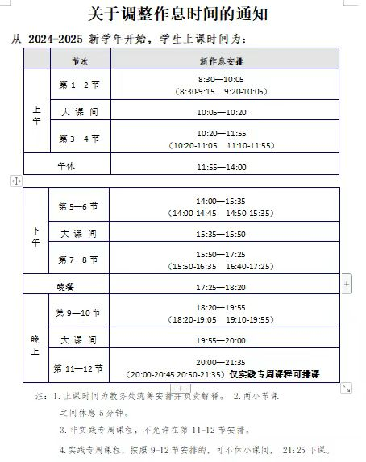

# Work and rest

Departments and Colleges:

In order to further improve the quality of personnel training, optimize the curriculum arrangement of students and combine learning
In fact, we hereby notify you of matters related to the adjustment of work and rest time as follows:

Starting with the new school year 2024-2025, adjust administrative hours and students
During class time, all departments and colleges should follow and make preparations.

**School Party and mass administration departments and teaching units administrative staff work day**
The time is:

8:30-12:00 am; 14:00-17:00.

Lunch break is 12:00-14:00; The staff canteen is open at 11:45.

**Students' class time is:**

