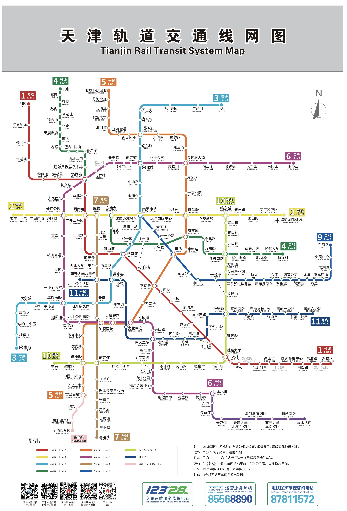

# Introduction to Tianjin Metro

Before entering the Tianjin subway station, a security check is required. Please voluntarily accept the inspection for packages of all sizes. Those who bring water may be asked to take a sip. The entrance gate is for one-way traffic, passengers should be aware that gates with green hooks can pass through. The subway station can accept physical tickets and electronic QR codes (NFC), face scanning, and other methods. 
[See details](../2-Transportation-Overview/Transportation.md)

