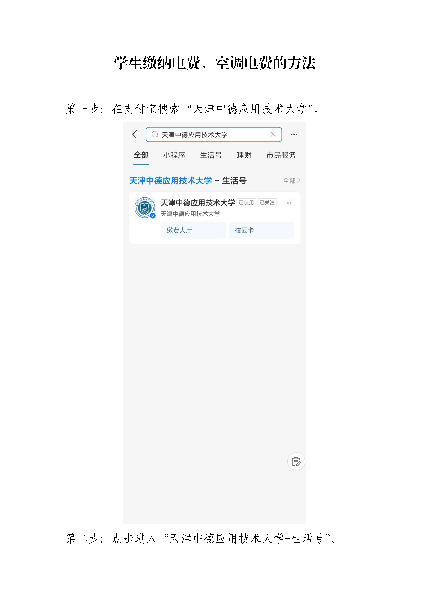
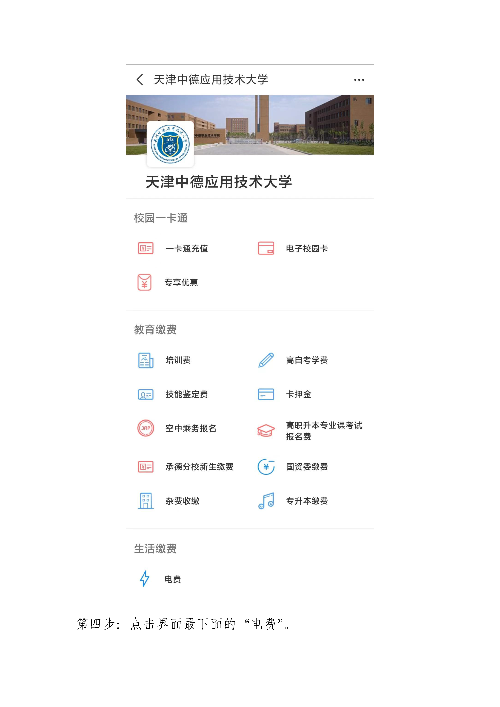
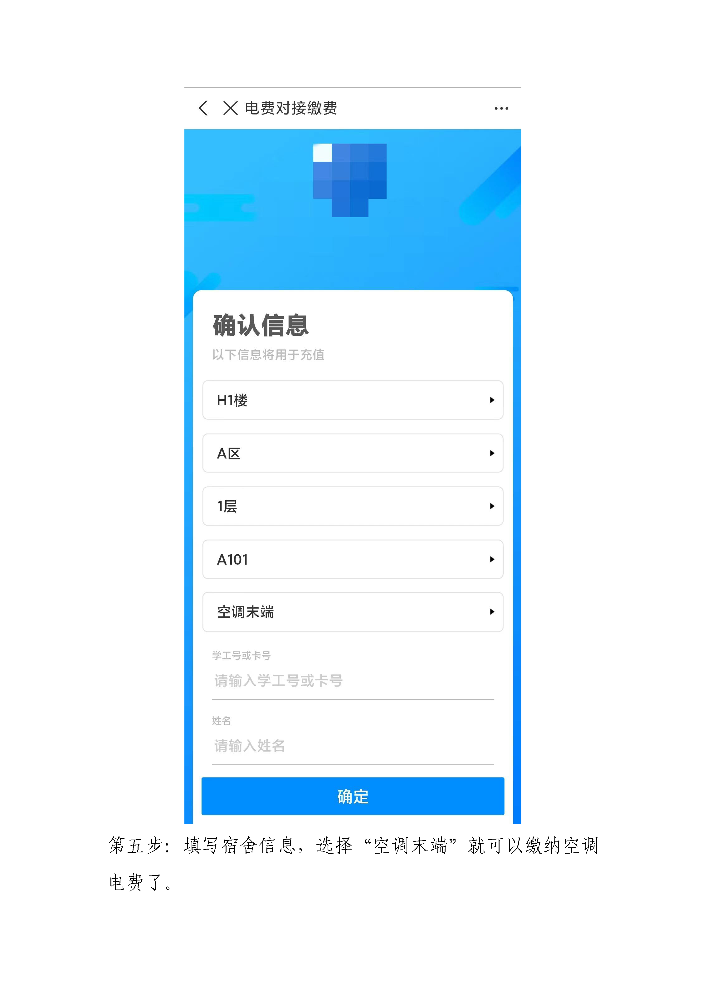

# 缴纳电费和空调电费的方法

- 宿舍的电费和空调都是**需要缴费**才能使用的，而且是**分开交**的。

- 建议时不时查看一下**电费余额**，或者**交的稍微多一点**（也不要太多），以免“电到用时方恨少”。
  
- 毕竟谁也不想见到周五或周六晚上突然停电，然后手机充不了电，WiFi断掉，游戏断联吧（别问我是怎么知道的＞﹏＜）。

- 啊对了，新同学们是不是会有这么个疑惑：明明我没有缴费，却也能开灯，能充电什么的。答案就是因为之前的学长学姐们多充了一点点（不排除学校在新生刚刚开学一段时间不要求缴费）。

下面就是就是缴费操作啦~

