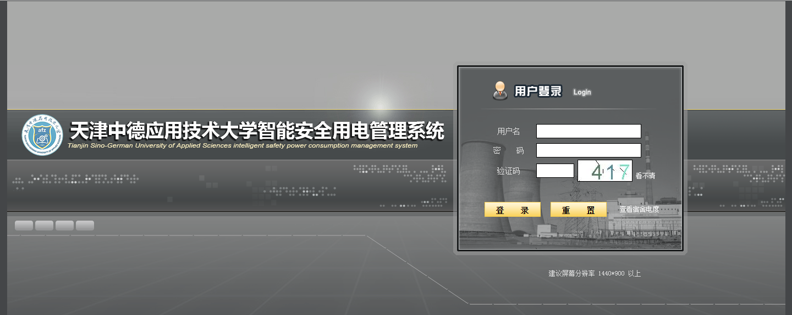
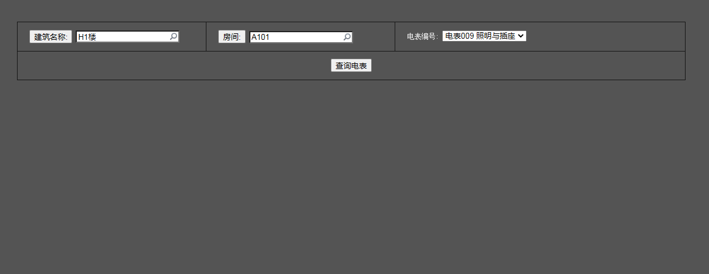

# 缴纳照明电费、空调电费的方法

## 缴费时间

每天6点到22点

## 缴费方法

- 第一步：在支付宝搜索“天津中德应用技术大学”。

- 第二步：点击进入“天津中德应用技术大学-生活号”。

- 第三步：点击“缴费大厅”。

- 第四步：点击界面最下面的“电费”。

 
- 第五步：填写宿舍信息，选择 “照明末端” 可以缴纳照明电费；选择 “空调末端” 可以缴纳空调电费（**租赁空调的宿舍再缴纳，否则只缴纳电费还是使用不了空调**）。“学工号或卡号”一栏可任意填写。

## 温馨提示

- 1.同学们在缴纳电费时一定要确认好缴费信息，以免缴错宿舍。

- 2.学生操作时如有疑问或缴错宿舍可以联系所在宿舍楼的宿管阿姨。宿管阿姨那边有控电系统工程师的联系方式，会帮同学们解答。

- 3.查询宿舍电费除了在支付宝查询外，也可登录“天津中德应用技术大学智能安全用电管理系统”查询。此功能只支持在校园内访问。

## 学校安全用电管理系统使用方法

- 第一步：输入网址：10.0.200.89:5088

- 第二步：点击“重置”旁边的“查看宿舍电度”。

- 第三步：选择“楼宇名称”、“房间”、“电表编号”（照明还是空调电表），点击“查询电表”就可以查询了。查询结果如下所示。

<!-- # 缴纳电费和空调电费的方法

- 宿舍的电费和空调都是**需要缴费**才能使用的，而且是**分开交**的。

- 建议时不时查看一下**电费余额**，或者**交的稍微多一点**（也不要太多），以免“电到用时方恨少”。
  
- 毕竟谁也不想见到周五或周六晚上突然停电，然后手机充不了电，WiFi断掉，游戏断联吧（别问我是怎么知道的＞﹏＜）。

- 啊对了，新同学们是不是会有这么个疑惑：明明我没有缴费，却也能开灯，能充电什么的。答案就是因为之前的学长学姐们多充了一点点（不排除学校在新生刚刚开学一段时间不要求缴费）。

下面就是就是缴费操作啦~ -->