# 校园卡使用说明

## 前言

终于迎来开学季，亲爱的同学们会拿到学校为你们准备的一张功能齐全，伴你整个大学生活的**校园卡**。我们先来认识认识它吧。

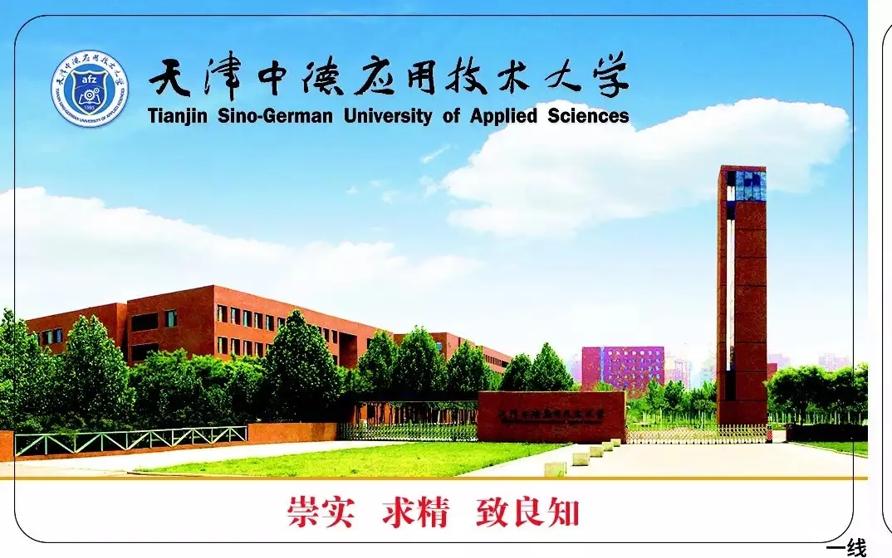

卡的样式你还喜欢吗？校训和校名的完美结合是不是很赞？赶快来看看它的功能吧！

## 充值篇

关于如何优雅地让帅哥and美女同学不再排队充值，我们开通了**支付宝**转账功能，方法如下，快来观摩......

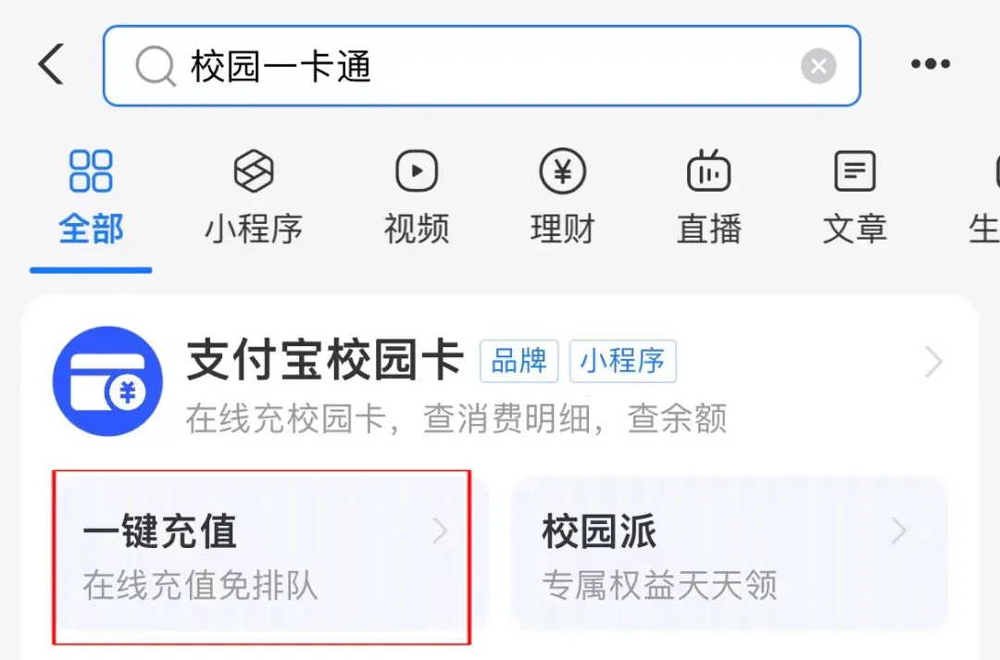

打开手机支付宝------搜索“校园一卡通”

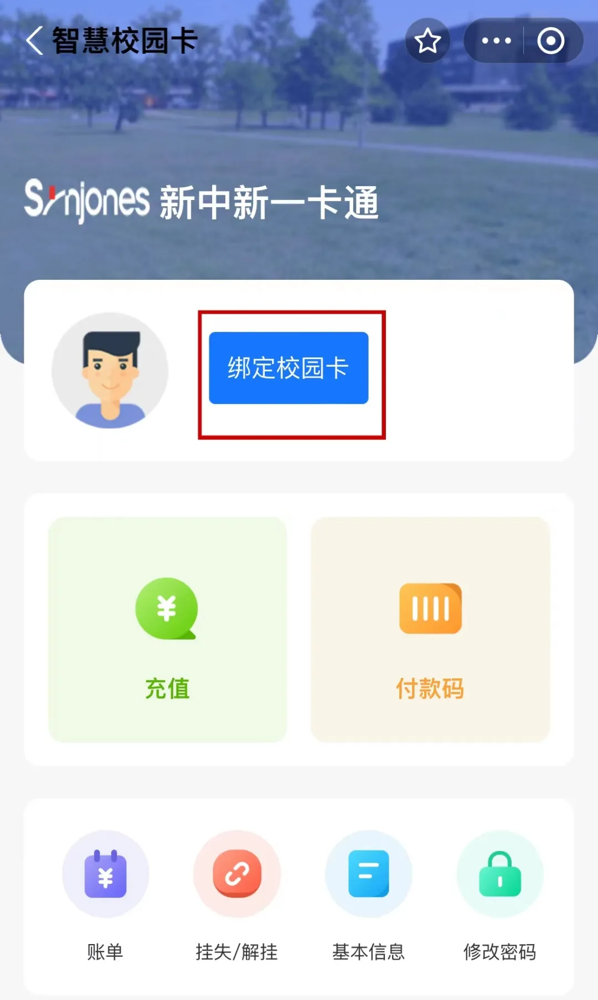

找到 “绑定校园卡”------选择学校输入“天津中德应用技术大学”

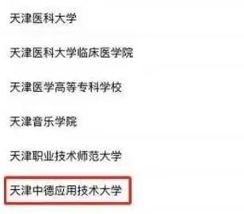

校验方式请点开 “ > ”

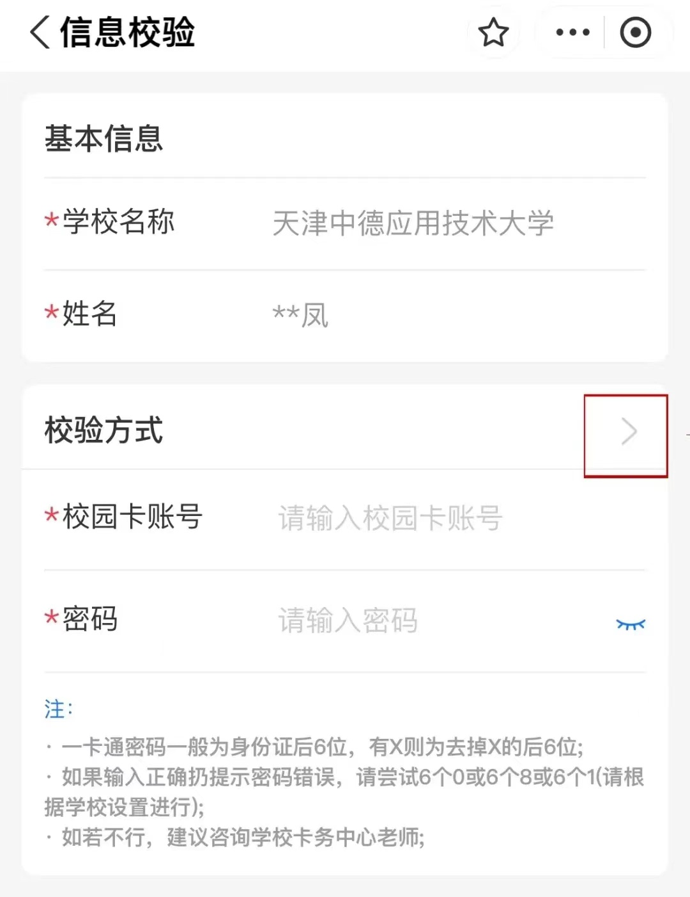

选择身份证号验证

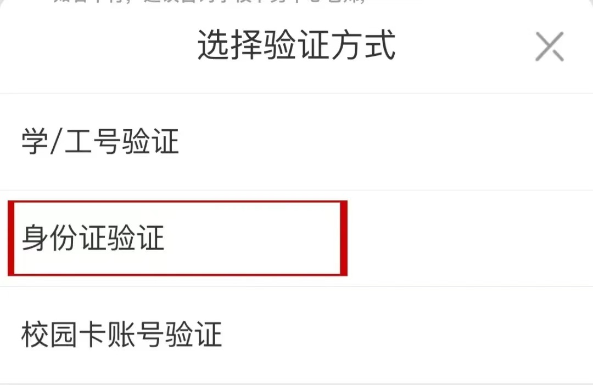

根据提示信息输入证件号码，即可充值

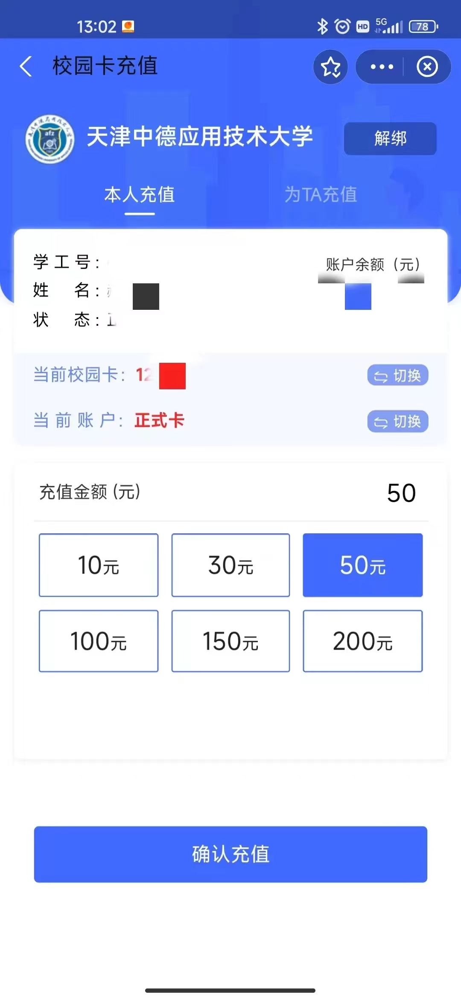

### 注意
开学季可能会遇到充值绑定高峰

若界面无反应，**刷新**即可

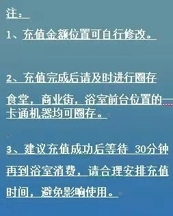

## 使用篇
亲爱的同学们：
使用支付宝为校园卡充值，请记得用卡前第一步要**到食堂拍卡领款**哦！校园里不是所有地方的刷卡机都联网，只有先到**食堂领到款再消费**才是正确的！

### 举个栗子:

> 小明：老师为什么我转账完校园卡总是不到账
>
> 小明：不到账是不是因为支付宝延时到账……

> 老师：转账完要到食堂拍卡领款才行！小朋友转账完就直接去了超市或是商业街消费是看不到本次转账的款项哦！支付宝转账是实时到账的，不存在延时到账的问题哦！

### 校园卡丢失了

卡丢了！！！别担心！   

丢卡后请立即到24小时自助中心挂失校园卡，这样的话别人捡到校园卡也无法使用。

也可以在支付宝“校园一卡通”进行挂失

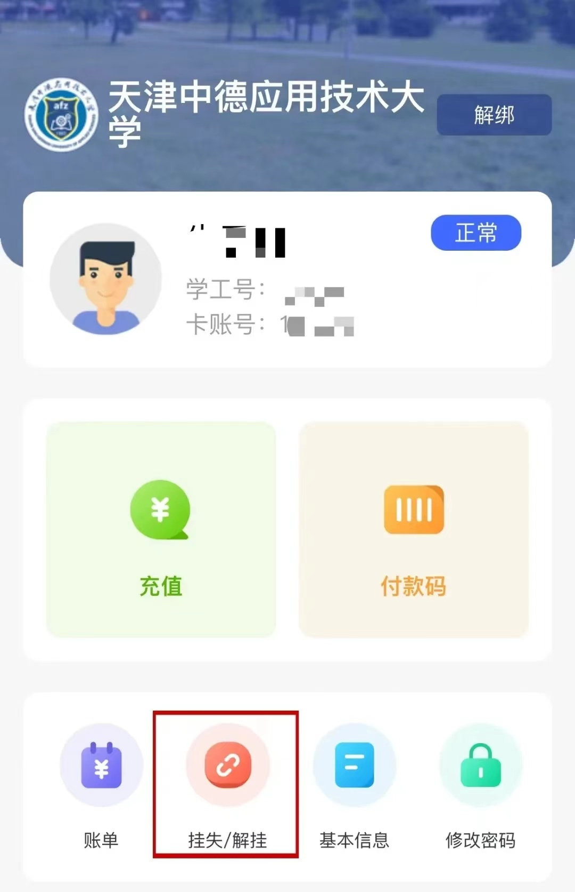

查询密码为身份证后六位数字

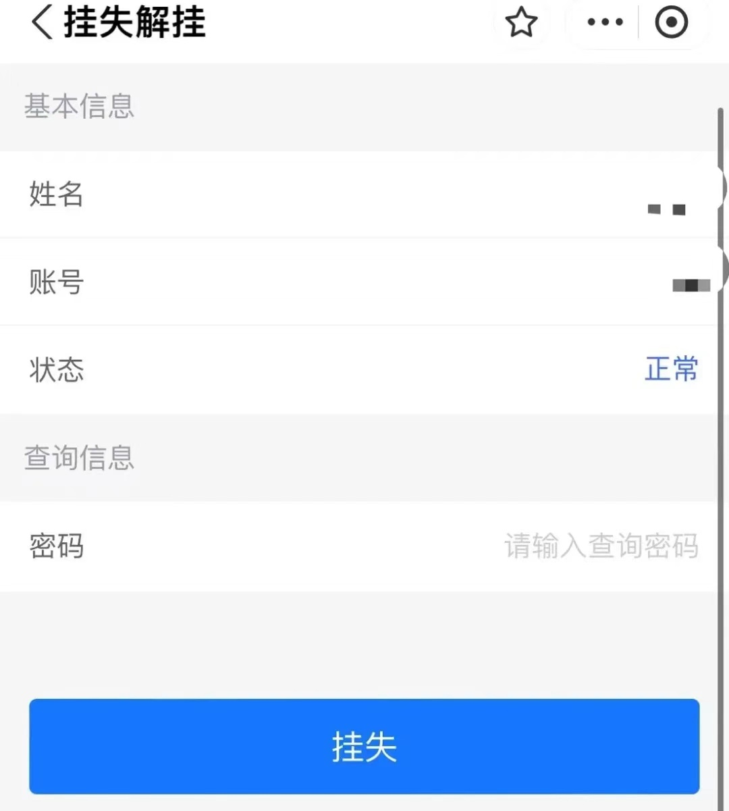

挂失很重要   千万别等钱都被人盗刷后才想起来自己没挂失！

挂失后又找到校园卡可以直接在本页面解除挂失就好了。

实在找不到了就要补卡了~

挂失补卡地点：24小时服务大厅内 
**（携带身份证办理哦）**

24小时服务大厅内设有两台补卡机

>请补卡的同学们请有序排队
>
>特别是在中午的时间，人流量较大的时候请同学们耐心等待

**补办校园卡时请同学们记得携带：**

- 身份证

- 制卡费用 ：15元 （补卡前账户内余额需大于15元）

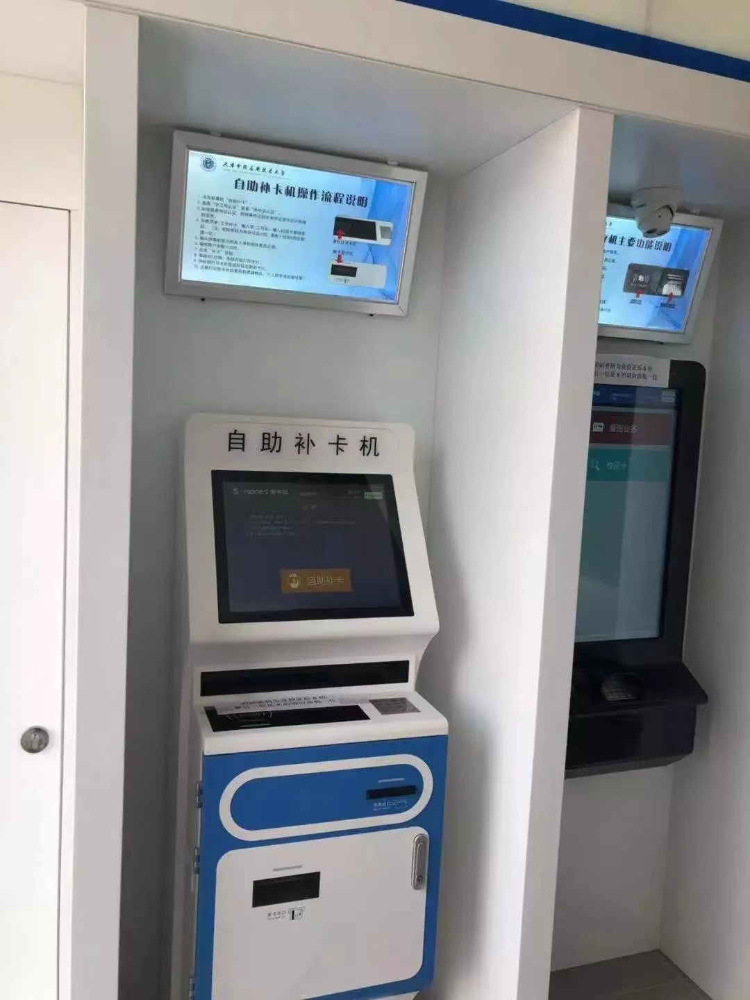

## 使用地点篇

- 1. 民族餐厅、学生餐厅、M座餐厅必须使用校园卡或支付宝扫码，不可以使用现金结算哦。

- 2. 校医院、 体育中心、图文信息中心需使用校园卡。

- 3. 整条商业街所有商户都可以使用校园卡刷卡消费。

- 4. 宿舍、图书馆门禁，需要刷卡方可使用。

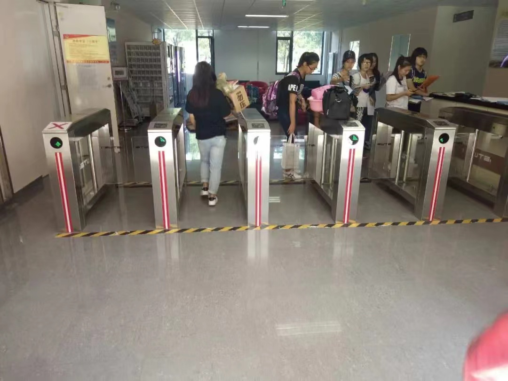

这是 H6 公寓门禁

>然鹅……
>
>你以为提示就这样愉快滴结束了？
>
>接下来就可以欢快的刷遍全校了？
>
>呵呵呵少年，精（zhong）彩（dian）在后面哦~

## 注意事项

- 1. 这张小小的校园卡仅可以在校园内使用，卡是免费发放的，并未收取卡的成本费，请保管好你的校园卡，如果丢失就需要到缴纳制卡工本费了哦！

- 2. 校园卡的初始密码是身份证号码的后6位，有X的向前顺延一位。密码是当你挂失卡片、超过每天消费限额（50元）时使用的。可以到圈存机去修改密码。

划重点，请记住以下事项：

- 挂失查询：24小时服务大厅

- 转账途径：支付宝

- 快捷支付方式：支付宝扫码消费 云闪付扫码消费

- 想要到校园卡结算中心办理服务？

>校园卡结算中心人工办公时间
>
>工作日12:00-13:00
>
>办公范围：临时卡的补卡、校园卡解冻 

**（学生挂失、补卡至24小时服务大厅）**

## 尾声

**从此手持校园卡自由玩耍**

[参考文档](https://mp.weixin.qq.com/s/vPaz1yFpIj19-w1YHhEtwA)<https://mp.weixin.qq.com/s/vPaz1yFpIj19-w1YHhEtwA>