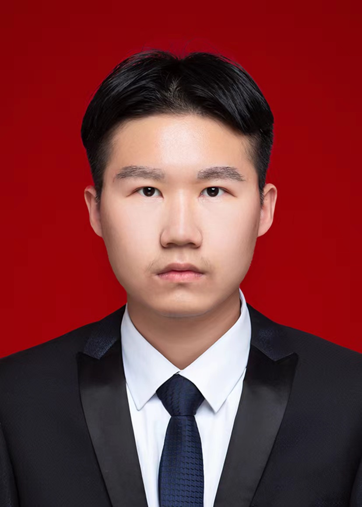
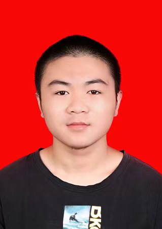

# 社团成员

### 社团重要成员信息

#### 1.刘奇翰

  

  * 个人简介:
    开源鸿蒙社社长、华为HSD校园大使、开放原子校源行开源大使、HiFOSS开源社区联合创始人
  
  * 研究方向:
    音视频编解码、机器视觉
  

#### 2.彭宇立

 

* 个人简介：
  开源鸿蒙社副社长、互联网+国赛团队成员

* 研究方向：
  外贸金融

#### 3.柳检

 

* 个人简介：
  开源鸿蒙技术部部长、开放原子校源行开源大使、HiFOSS开源社区成员

* 研究方向：
  音视频编解码、视频拼接

#### 4.李彤彤

 

* 个人简介：
  开源鸿蒙宣传部部长、华为开发者联盟成员

* 研究方向：
  工艺美术、艺术设计

#### 5.张济鹏

 

* 个人简介：
  开源鸿蒙运营部部长、华为开发者联盟成员

* 研究方向：
  后端开发、数据库管理

### 指导老师：杨清永

* 个人简介：
  软件与通信学院院长、正高工/硕士生导师、天津市“131”第一层次人才、天津市图像图形学会常务理事、中国教育技术协会技术标准委员会专家委员、天津市高新技术企业认定专家

* 研究领域：
  视频图像分析、人工智能和机器学习技术、视频编解码技术

### 技术支持：唐铭穗

开放原子教育讲师、开源之夏导师、开放原子年度开源贡献之星、狮偶开源项目维护者