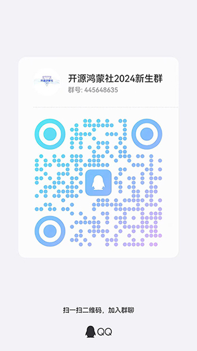

# 2024 纳新

本纳新手册是给想加入开源鸿蒙社的同学（特别是2024级的新同学们）来充分了解社团的。

这里包括了：

- 招新：招新时用到的海报，新成员QQ群图片，大屏展示图和PPT，人员安排和时间表等。

- 面试：面试时间和结果

- 迎新晚会：举行的时间和具体的活动内容。

## 招新

### 招新介绍
开源鸿蒙社是一个致力于推动开源技术发展的组织，于2023年6月25号正式成立，我们专注推广开源技术，提供交流、合作、培训与支持平台，鼓励成员共享代码与经验，共促开源技术发展。社团官网https://osc.tsguas.cn/

社团遵循三步走的培养思路
1. 走出去开拓视野。社团带领同学接触各大技术峰会：华为开发者大会、世界人工智能峰会、华为昇腾AI创享日、脑机接口大会、开放原子开源峰会等等。
2. 带回来以赛促学。在校内举办多场技术讲座、技术竞赛。社团内部分学习方向组队，可参与企业级项目开发；算法等计算机竞赛；互联网+、挑战杯等创赛。
3. 给平台绽放姿彩，为同学提供软硬件支持（算力服务器、开发板等）、企业实习机会、推荐大牛导师参与实际开源项目等。

在过去的一年中，社团核心成员积极参与各种竞赛，如“互联网+”等，共获得国家级奖项一次、市级奖项一次、银奖一次、铜奖两次，以及蓝桥杯等等其他各类比赛的奖项总计有国家级一项、市级六项。我们还发表了论文和专利各一篇，此外，我们与华为开发者联盟建立了合作关系，并基于HSD（Huawei Student Developer）组织创建了社团。同时，我们也成为了开放原子开源基金会的优秀单位。

### 新成员QQ群图片

### 2024-2025 开源鸿蒙社纳新表

### 社团各部门职责

- 宣传部：社团网站维护、公众号等运营。

- 运营部：git仓库管理、校内外活动筹备。

- 技术部：项目开发、各类竞赛等等。

