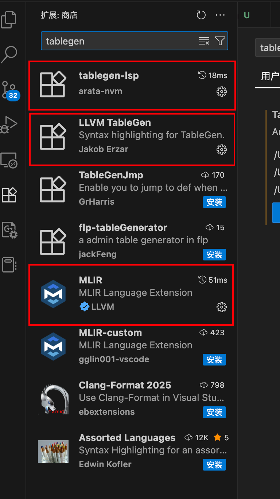
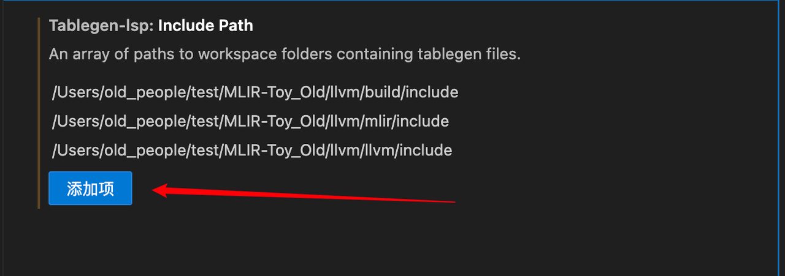

# 在vscode中如何配置TableGen and MLIR

## 第一步：
如图所示，在vscode中寻找tablegen相关插件

下载图中用红框圈住的插件后进入`ctrl+，`快捷键进入设置界面，输入`tablegen-lsp.includePaths`
## 第二步：

如图所示，初次进入这里面应该是空白的，我们点击添加项，按照图中的路径找到你的llvm中`build/mlir/llvm`中的include把绝对路径粘贴上去\
⚠️请注意，如果llvm项目是你所开发项目的依赖，那么请在`Include Path`中添加你项目中`include`的路径，以确保它能够找到你的`.td等文件`
# 第三步：
最后一步按 `Ctrl+Shift+P` 运行 Developer: Reload Window，这样就能将你的配置保存起来了。你的tablegen就可以进行定义跳转等功能了

