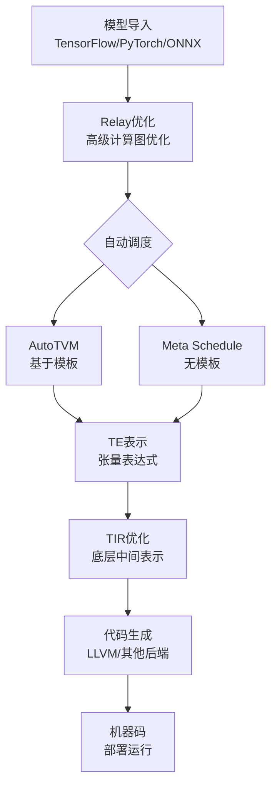

# Apache TVM 深度学习编译器：技术演进与生态系统

## 1. TVM 概述

Apache TVM（张量虚拟机）是一个开源的深度学习编译器栈，旨在将机器学习模型高效地部署到各种硬件后端（包括CPU、GPU和专用加速器）。TVM的核心使命是**解决深度学习模型与多样硬件后端之间的"最后一公里"性能优化问题**。
[快速上手使用指南](./How_to_run_TVM.md) <- 点击此处可快速上手体验。⚠️记得先配置好TVM

## 2. TVM 的核心架构与工作流程

TVM采用分层编译架构，将深度学习模型的部署流程系统化、自动化。其完整的工作流程如下图所示：

### 核心组件详解

- **前端导入与 Relay**：TVM 支持从 **TensorFlow、PyTorch 或 ONNX** 等主流框架导入模型。模型会转换为 TVM 的高级函数式中间表示 **Relay**。Relay 会进行**计算图级别的优化**，如算子融合、常量折叠、死代码消除等。

- **张量表达式与自动调度**：优化后的 Relay 计算图会被**降级为张量表达式**，这是一种用于描述张量计算的领域特定语言。这是TVM最具创新性的部分，提供了两种自动优化路径。

- **底层优化与代码生成**：基于优化结果，TE表示会进一步降级为TIR，这是TVM的**底层中间表示**，会进行循环优化、内存布局变换等底层优化。最后，优化的 TIR 会由 **LLVM** 等编译器后端生成针对目标硬件的高效机器码。

## 3. TVM 自动调优技术的演进

TVM的自动调优技术经历了显著的演进，从初期的基于模板方法发展到现代的完全自动化方案。

### 技术演进历程

#### 阶段一：AutoTVM - 基于模板的探索

作为第一代自动调优系统，AutoTVM的核心是**"模板"**。开发者需要为每个算子手动编写参数化的调度模板，明确指定可优化参数（如循环分块大小、向量化因子等）。AutoTVM的tuner（如XGBTuner）在预设的参数空间中进行搜索。

**特点**：
- **强依赖专家经验**：需要深入了解硬件特性和优化技术
- **搜索空间受限**：优化潜力受限于预定义的模板
- **精细控制**：对特定算子可以进行精细化调优

#### 阶段二：Ansor (Auto-Scheduler) - 自动生成程序

Ansor的出现解决了AutoTVM对模板的依赖问题。其核心思想是**自动为整个计算图生成和搜索调度程序**，无需任何预定义的模板。它通过分层策略（先生成高层"草图"，再添加底层"注释"）构建巨大的搜索空间。

**创新点**：
- **模板无关**：完全摆脱对手动编写模板的依赖
- **全图优化**：考虑整个计算图的优化机会
- **自动化程度高**：大幅降低使用门槛

#### 阶段三：Meta Schedule - 统一与可重用的学习系统

Meta Schedule是Ansor思想的**系统化与升华**，已成为TVM中**标准且推荐的自动调度框架**。它构建了以**可重用的成本模型**为核心的统一学习基础设施，能够学习程序特征与硬件性能之间的映射关系。

**核心优势**：
- **知识重用**：学习到的优化策略可以在不同模型和硬件间迁移
- **端到端自动化**：提供完全自动化的优化流程
- **持续学习**：随着使用不断积累和优化调度知识

### AutoTVM 与 Meta Schedule 对比

| 对比维度 | AutoTVM (基于模板) | Meta Schedule (无模板) |
| :--- | :--- | :--- |
| **核心思想** | 依赖人工预定义的**调度模板**，在模板定义的参数空间中搜索。 | 自动构建搜索空间，通过**成本模型**等机器学习技术进行引导。 |
| **自动化程度** | **较低**，需要专家知识编写模板。 | **高**，端到端自动化，无需手动定义模板。 |
| **搜索空间** | 由模板限定，**相对有限**，可能错过模板外的更优解。 | **自动生成**，更**全面且灵活**，能发现非直觉的优化策略。 |
| **知识重用** | 调优记录可保存，但重用性较弱。 | 支持强大的**跨工作负载和跨模型知识重用**。 |
| **适用场景** | 对特定算子进行**精细化调优**。 | **全图优化**、新硬件平台、复杂算子。 |

## 4. TVM 在深度学习编译器生态中的定位

### 与其他相关技术的比较

| 技术名称 | 主要特点 | 与TVM的关联与差异 |
| :--- | :--- | :--- |
| **Tensor Comprehensions (TC)** | 采用**多面体模型**进行循环优化，自动化程度高。 | 技术路线不同。**TVM初期性能更优**，而TC在自动化方面有优势，两者技术上存在互补性。 |
| **XLA** | Google推出，与TensorFlow生态绑定紧密。通过**HLO IR**进行设备无关优化。 | **设计层级不同**。XLA的HLO IR同时包含高层计算图和底层运算细节；TVM的IR则明确分为计算图和算子两层。 |
| **MLIR** | LLVM生态系统中的多层中间表示框架，提供基础设施。 | **互补关系**。TVM可以基于MLIR构建其IR系统，MLIR为TVM等高级框架提供底层基础设施。 |
| **传统编译器 (如GCC, LLVM)** | 专注于通用编程语言的优化，如**寄存器分配、指令选择**等。 | **优化目标不同**。TVM等深度学习编译器更关注**全局计算图优化、自动生成接近手写性能的特定算子**等。 |

### 生态系统整合

TVM积极与业界生态系统整合：
- **与MLIR协作**：TVM可以输出MLIR格式，利用MLIR的基础设施
- **硬件后端支持**：支持从x86/ARM CPU到NVIDIA/AMD GPU，以及各种专用AI加速器
- **框架兼容性**：提供与主流深度学习框架的无缝对接

## 5. TVM 的应用场景与价值主张

### 核心应用场景

TVM在以下场景中展现突出价值：

- **应对"长尾"算子**：对于实验性模型结构或出现频率不高的算子，硬件厂商提供的优化库可能支持不足。TVM的**自动代码生成能力**能有效处理这些"长尾"问题。

- **跨硬件平台部署**：当需要在**多种硬件**上保持统一体验和良好性能时，TVM的**统一编译框架**能显著减少为不同硬件手动优化的工作量。

- **前沿研究与探索**：TVM的**可扩展设计和自动化优化能力**，使其成为研究模型量化、稀疏化计算等前沿技术的理想平台。

- **边缘设备部署**：对于资源受限的边缘设备，TVM能够生成高度优化的代码，充分利用有限的计算资源。

### 实践建议

对于开发者而言：

- **新项目首选Meta Schedule**：它是TVM未来发展的方向，具有更高的自动化程度和优化潜力。

- **遗留代码逐步迁移**：现有的AutoTVM项目可以逐步迁移到Meta Schedule，享受更好的优化效果和开发体验。

- **结合硬件特性**：理解目标硬件的特性（缓存层次、向量单元等）有助于更好地利用TVM的优化能力。

## 6. 未来展望

TVM社区持续推动深度学习编译技术的发展：

- **更智能的自动调度**：结合强化学习等先进AI技术进一步提升自动调度的效果
- **更广泛的硬件支持**：扩展对新兴AI芯片和专用加速器的支持
- **全栈优化**：从算法到硬件的端到端协同优化
- **标准化与生态建设**：推动深度学习编译标准的建立和完善

## 7. 总结

Apache TVM 通过引入编译技术，构建了一个**解耦深度学习模型与硬件平台的自动化性能优化框架**。其以**分层中间表示**和**自动调度**为核心，经历了从基于模板的AutoTVM到完全自动化的Meta Schedule的技术演进，有效解决了深度学习模型在多样化硬件上的高效部署问题。

在日益复杂的深度学习硬件生态中，TVM作为连接算法与硬件的桥梁，通过统一的编译框架显著降低了模型部署的复杂度，为深度学习技术的普及和应用提供了坚实的技术基础。随着Meta Schedule等新技术的成熟和推广，TVM正在让高性能的深度学习推理变得更加普及和易用。

## 8.相关文章推荐
[【从零开始学深度学习编译器】一，深度学习编译器及TVM 介绍](https://zhuanlan.zhihu.com/p/358585143) 

[TVM/TVM从入门到入土](https://comsoftwhu.github.io/AI-compile/TVM/TVM%E4%BB%8E%E5%85%A5%E9%97%A8%E5%88%B0%E5%85%A5%E5%9C%9F.html)

---

> **作者：** ChatGpt\
>**提交者：** 王胤吉\
> **更新日期:** 2025/11/3
