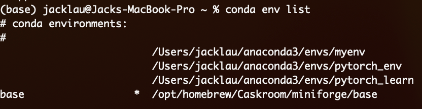
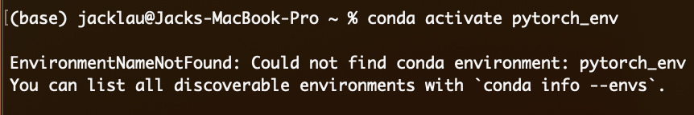

# 关于conda虚拟环境无法显示名称的解决方案

## 介绍

Conda是一个开源的软件包管理系统和环境管理系统，用于安装和管理多个版本的软件包和其依赖项。它可以在不同的操作系统上运行，包括Windows、MacOS和Linux等。

通过Conda，用户可以创建和管理Python环境并安装各种Python包，也可以安装其他语言的软件包，如R、C++等。此外，Conda还提供了虚拟环境的功能，用户可以在虚拟环境中使用特定版本的Python和软件包，而不会影响全局安装环境。

Conda的优点在于它可以快速地安装和更新软件包，并且可以解决软件包之间的依赖关系，从而避免了因为不同版本的软件包之间的冲突而导致的问题。此外，Conda还提供了易于使用的命令行工具和图形界面来管理软件包和环境。

## 问题复现
使用 ``conda env list``

并且conda activate 没有显示名字的环境是不可以的 

## 解决方案
### 以下操作以激活 ``pytorch_env`` 为例

先检查环境变量里是否有 anaconda3/bin
```
echo $PATH
```
如果没有的话 就加上
```
export PATH="/path/to/anaconda/bin:$PATH"
```
再使用 ``conda env list`` 和 ``conda activate pytorch_env`` 

如果还不行的话 就输入以下指令

```
source activate pytorch_env
```
这时候就能成功激活``pytorch_env``环境了

再使用
```
conda env list
```
就可以正常显示环境名称了 同样``conda activtae``也是可以正常使用了

## 总结

conda可能有时候会抽风出bug  无法正常使用自带的命令 

而 ``source activate`` 命令是python命令 一般在Linux和MacOS上使用 在conda抽风的时候 临时用一下还是ok的
