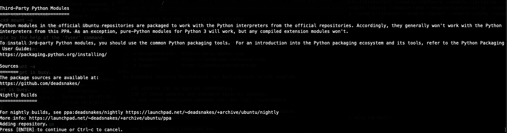
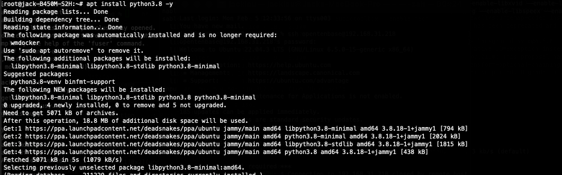
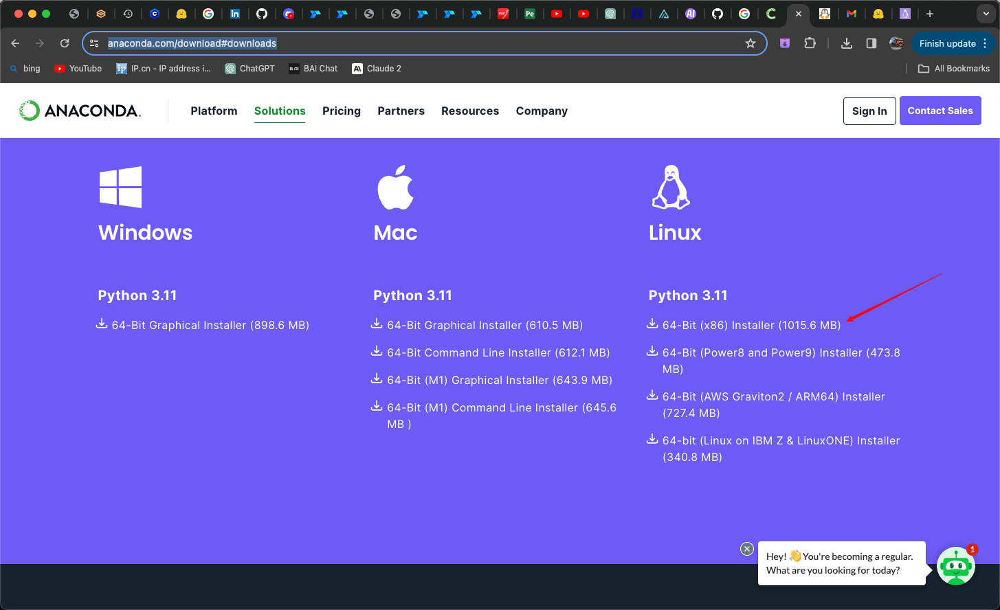
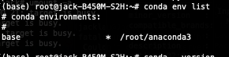
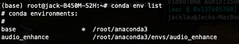
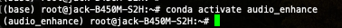

# python指定版本安装及Conda环境配置（Ubuntu、MacOS）

## 安装python
python许多新的版本不在默认apt源仓库中 因此我们需要增加仓库
```bash
sudo add-apt-repository ppa:deadsnakes/ppa
```



按Enter键以确定添加



现在就可以安装指定版本了
```bash
apt install python3.8
```

如果觉得输入每次使用都要输入python3.8不太方便 可以使用别名功能，在`~/.bashrc`文件中添加

```bash
vim ~/.bashrc
```

```bash
alias python=python3.8
```


## 安装Conda

在[官网](https://www.anaconda.com/download#downloads)获取指定的版本，下载后运行脚本即可



```bash
bash Anaconda3-2023.09-0-Linux-x86_64.sh
```

安装成功后激活一下环境
```bash
source ~/.bashrc
```

命令行最前端出现base标识，说明已激活conda环境


创建你所需要的虚拟环境,可指定python版本及你所需要的各种包
```
conda create -n <my_env> python=3.8 numpy pandas
```

使用`conda env list`查看所有的conda虚拟环境



使用`conda activate`命令激活指定环境
```bash
conda activate audio_enhance
```

此时命令行前端现实的环境名称也会改变


可以验证下python版本 以及指定的各种包
```
python --version
pip list
```

