# MySQL

## 一、下载

本教程采用的是MySQL最新的社区版-MySQL Community Server 8.0.26

下载地址：https://downloads.mysql.com/archives/installer/

## 二、安装

要想使用MySQL，我们首先先得将MySQL安装好，我们可以根据下面的步骤，一步一步的完成MySQL的
安装。

1. 双击官方下来的安装包文件

2.  根据安装提示进行安装

> 注意：路径选择没有中文空格等的规范路径

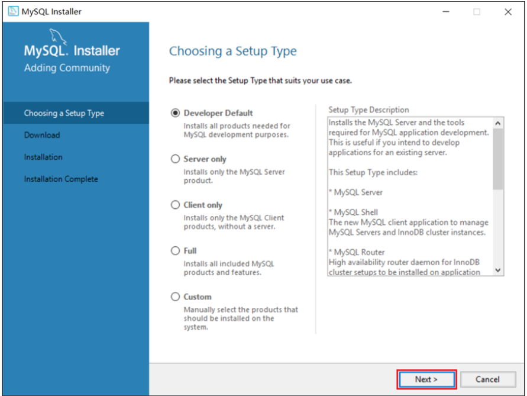

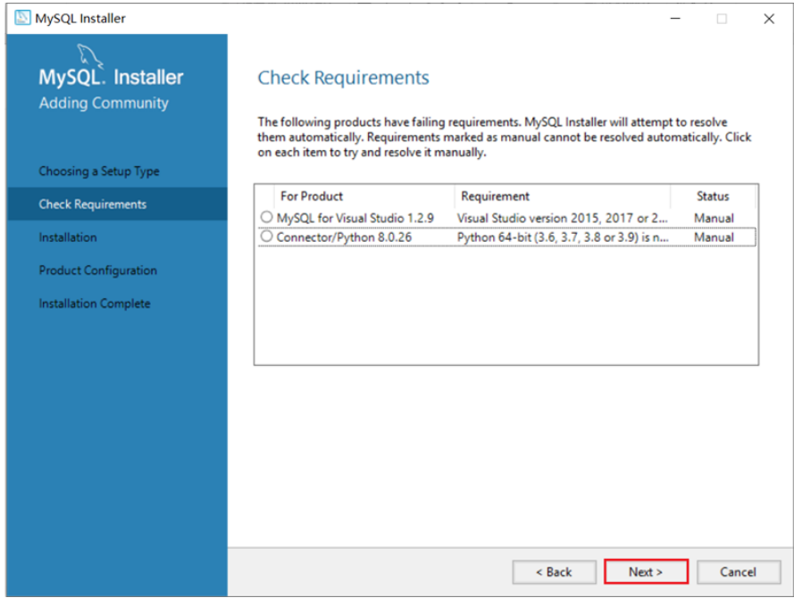

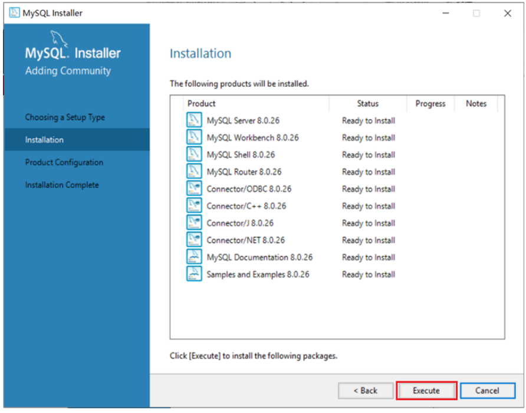

安装MySQL的相关组件，这个过程可能需要耗时几分钟，耐心等待。

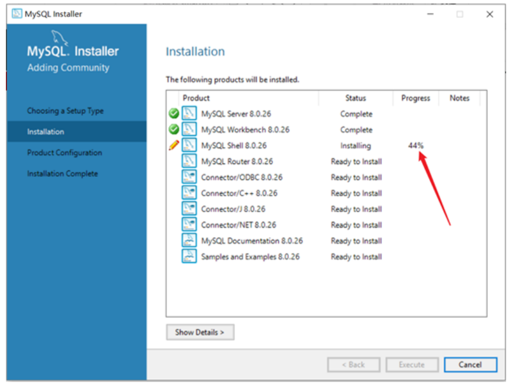

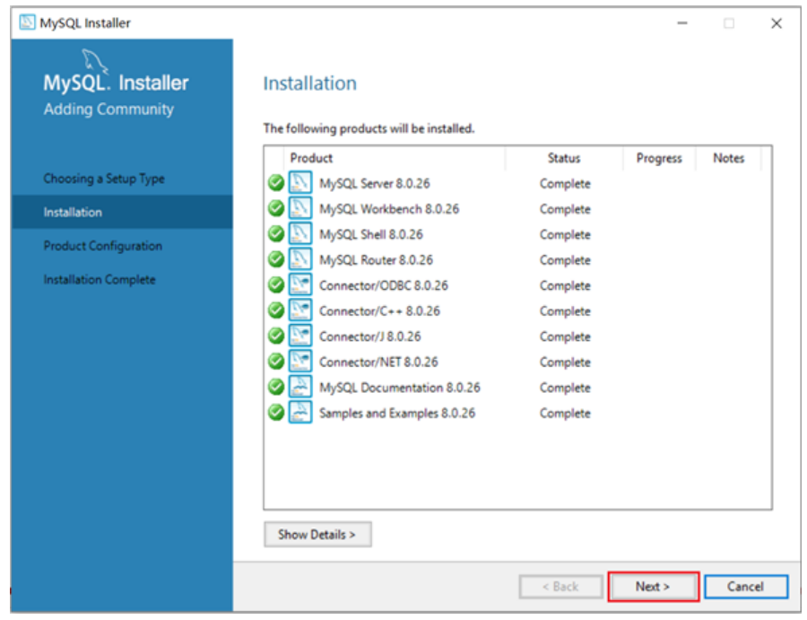

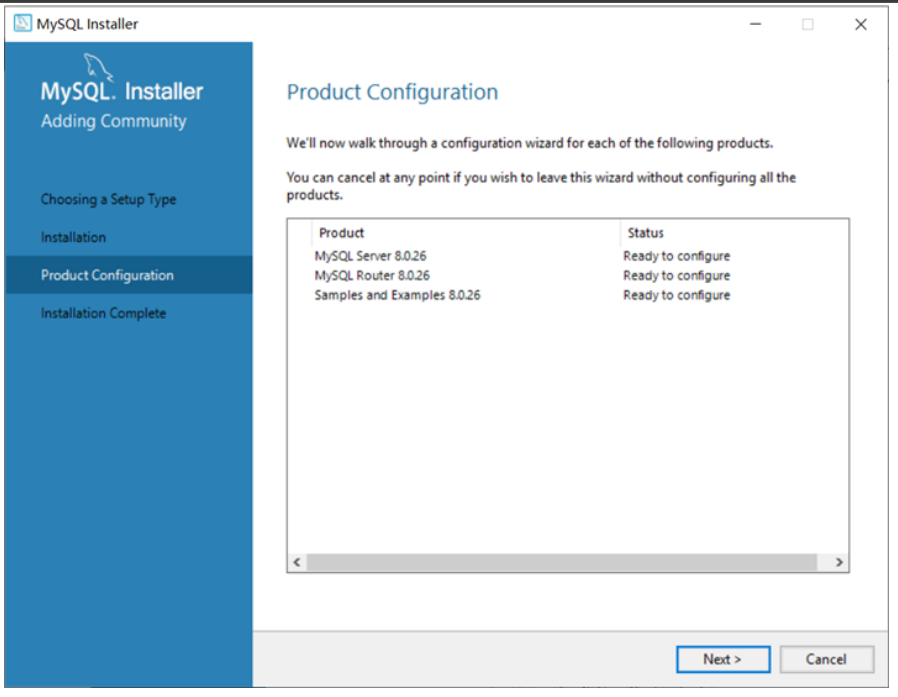

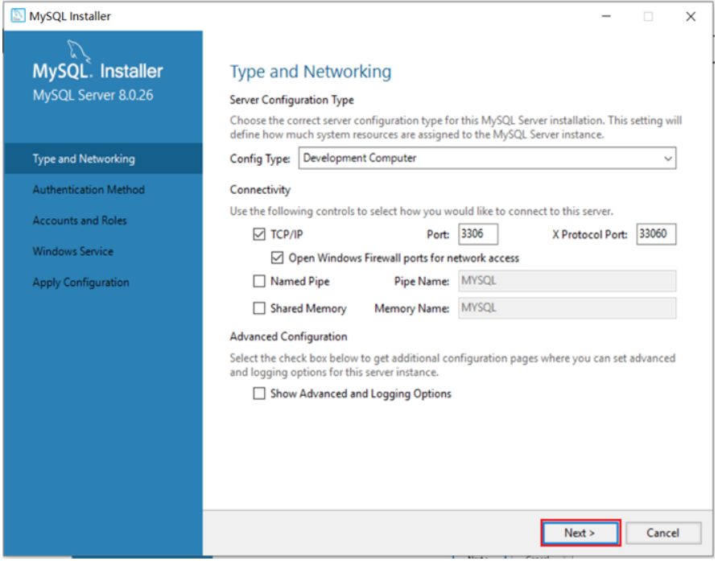

**输入MySQL中root用户的密码,一定记得记住该密码**

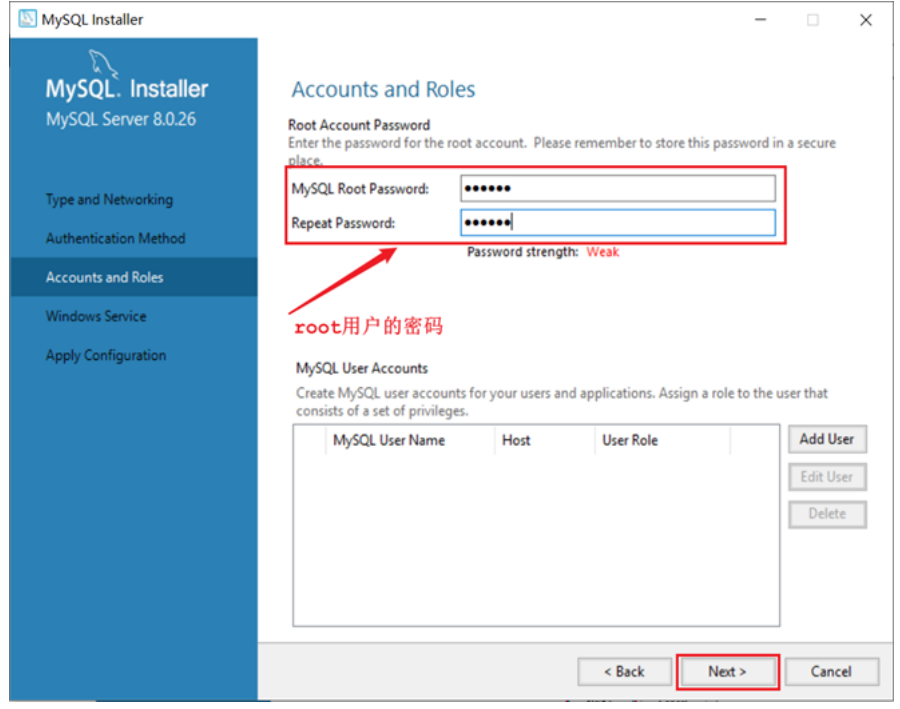

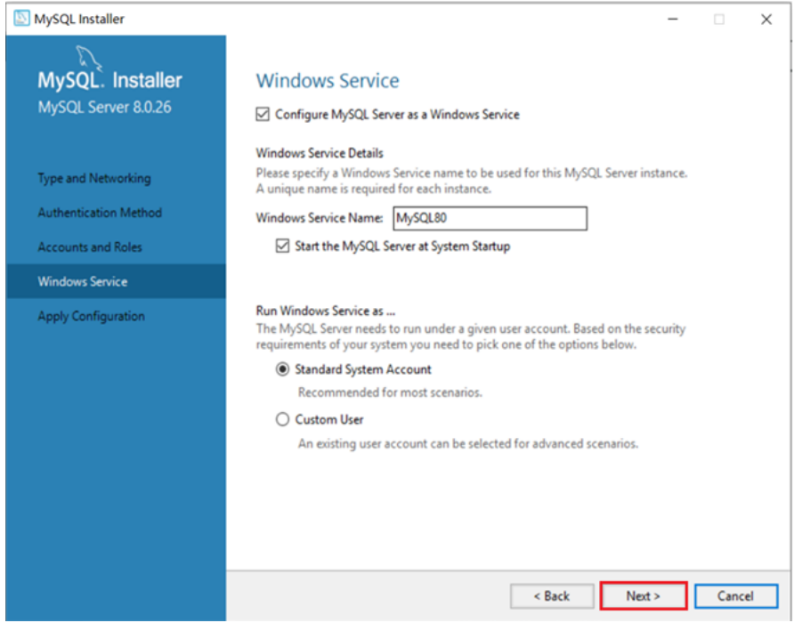

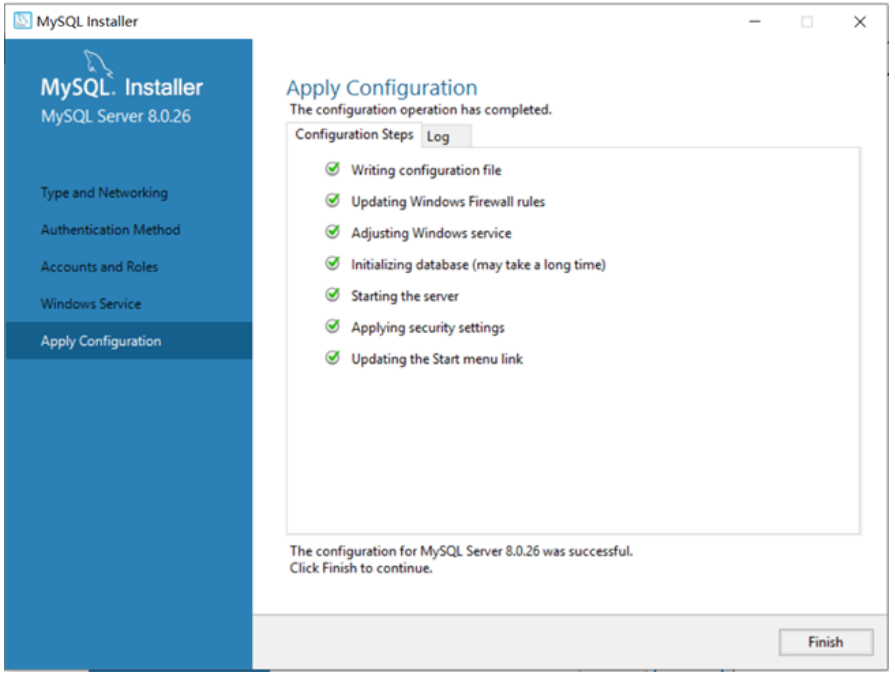

1. 配置

安装好MySQL之后，还需要配置环境变量，这样才可以在任何目录下连接MySQL。

A. 在此电脑上，右键选择属性

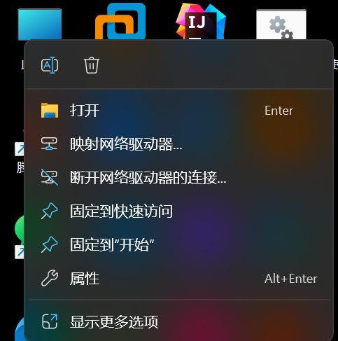

B. 点击 "高级系统设置"，选择环境变量

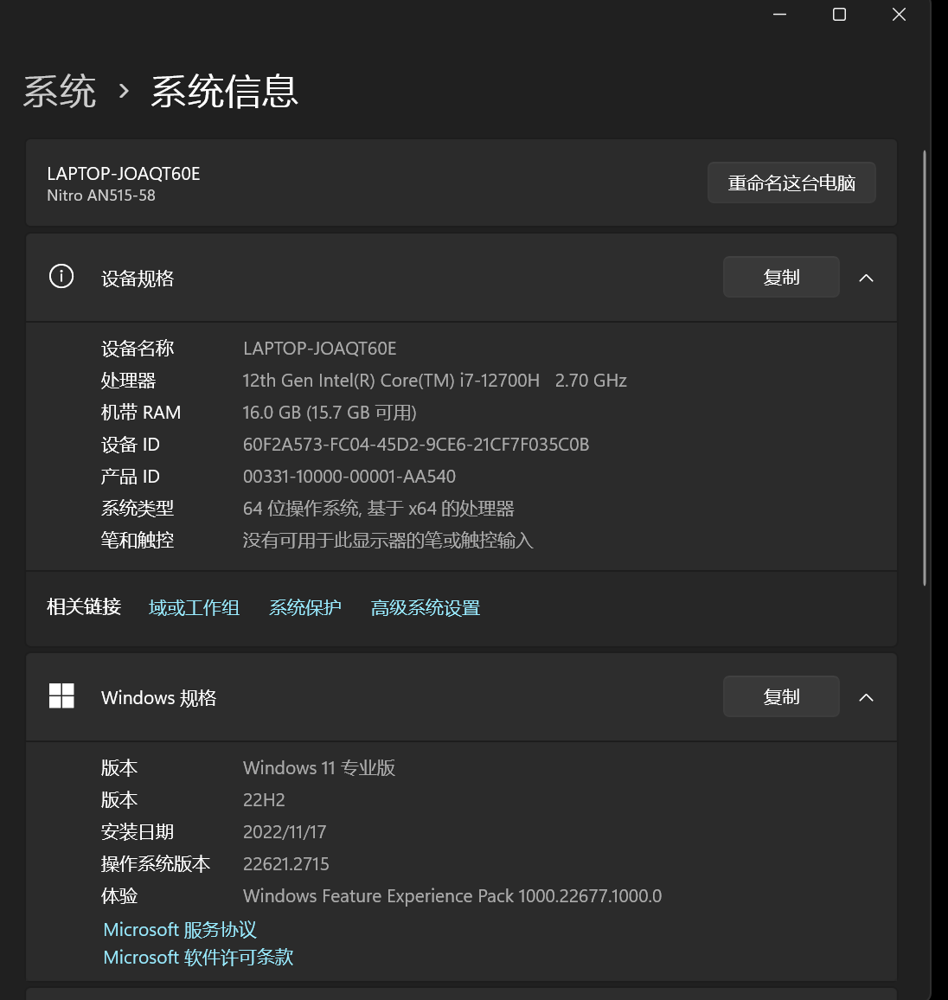

C. 找到 Path 系统变量, 点击 "编辑"

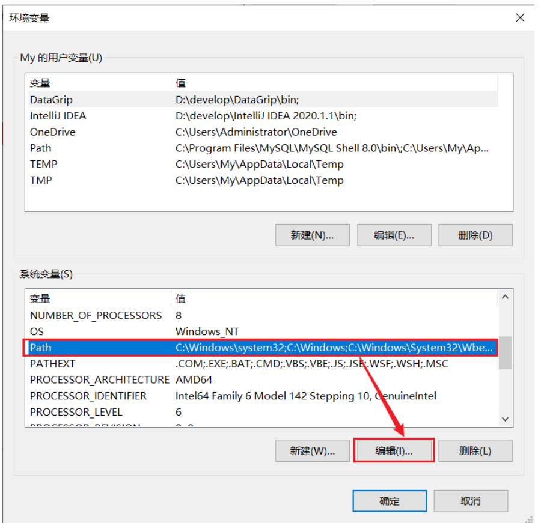


D. 选择 "新建" , 将MySQL Server的安装目录下的bin目录添加到环境变量

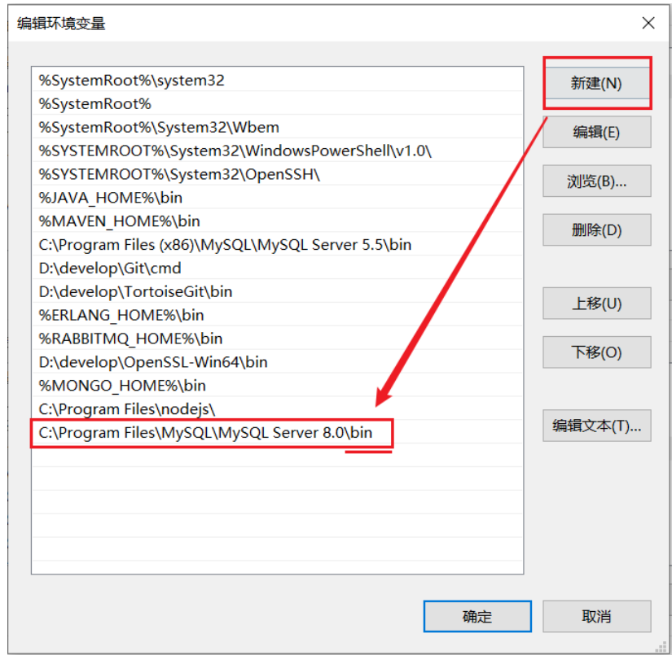

## 三、 启动停止

MySQL安装完成之后，在系统启动时，会自动启动MySQL服务，我们无需手动启动了。

当然，也可以手动的通过指令启动停止，以管理员身份运行cmd，进入命令行执行如下指令：

```
net start mysql80
net stop mysql80
```

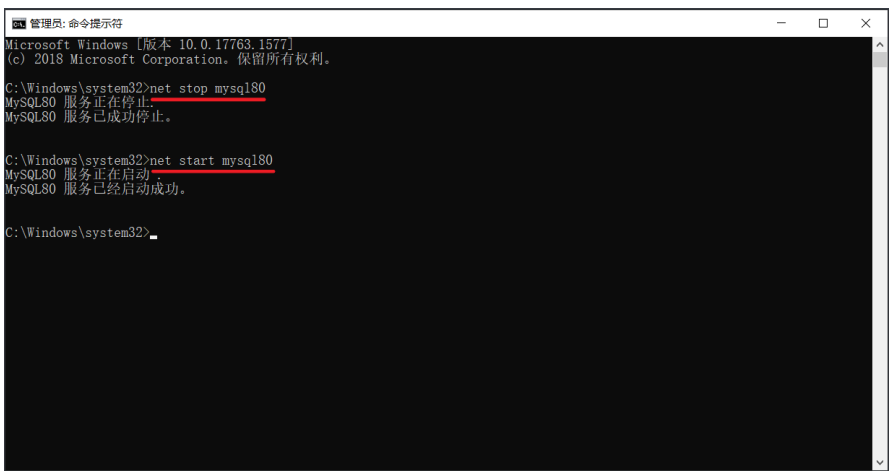

> 注意 ： 上述的 mysql80 是我们在安装MySQL时，默认指定的mysql的系统服务名，不是固
> 定的，如果未改动，默认就是mysql80。
> 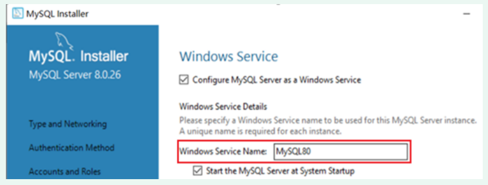

## 四、客户端连接

1. 方式一：使用MySQL提供的客户端命令行工具

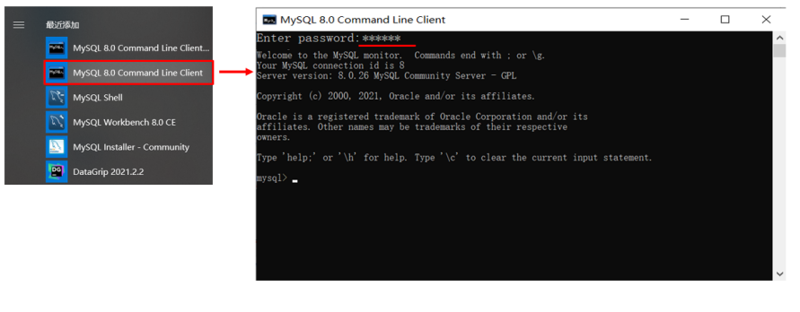

2. 方式二：使用系统自带的命令行工具执行指令

```
mysql [-h 127.0.0.1] [-P 3306] -u root -p

参数：
    -h : MySQL服务所在的主机IP
    -P : MySQL服务端口号， 默认3306
    -u : MySQL数据库用户名
    -p ： MySQL数据库用户名对应的密码
```

[]内为可选参数，如果需要连接远程的MySQL，需要加上这两个参数来指定远程主机IP、端口，如果
连接本地的MySQL，则无需指定这两个参数。

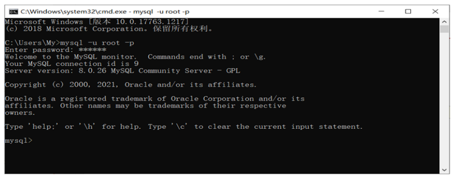

> 注意： 使用这种方式进行连接时，需要安装完毕后配置PATH环境变量。

