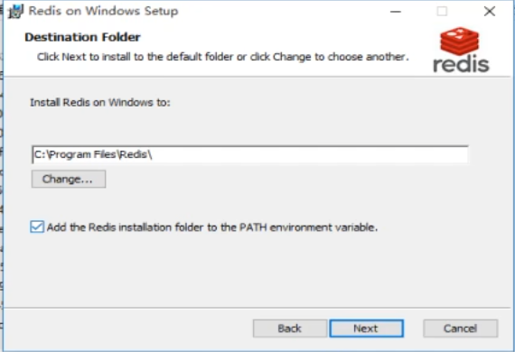
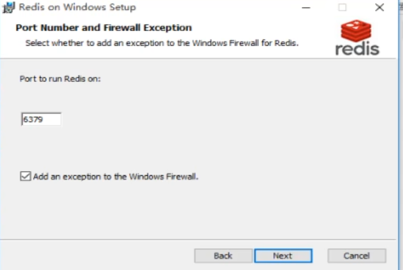
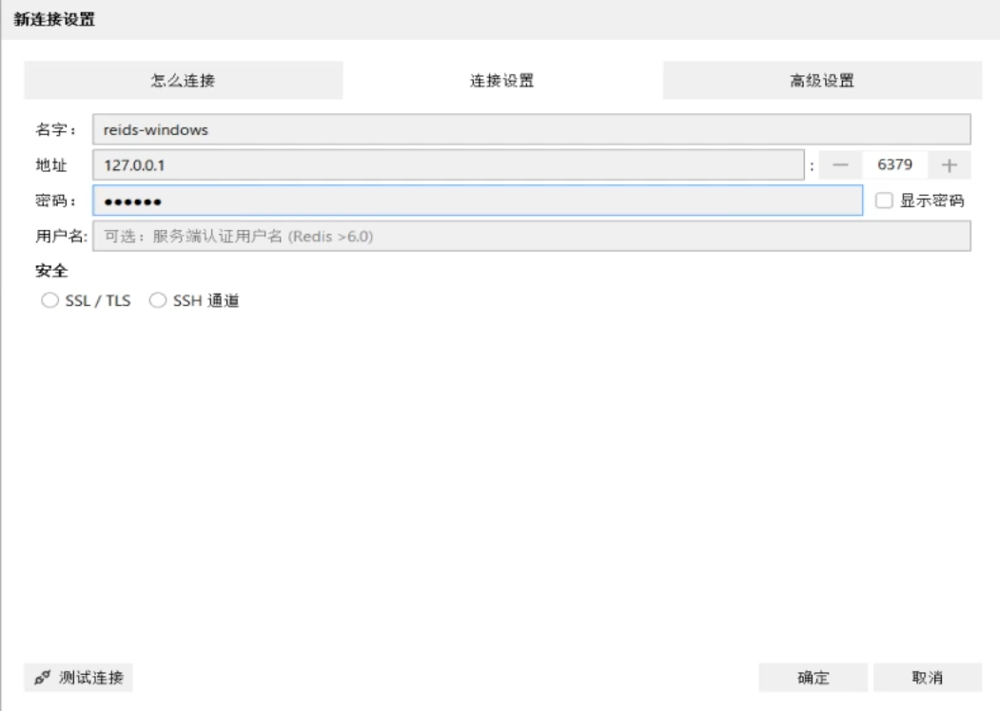

# 安装配置redis

## 一、下载redis

- redis下载链接：https://github.com/tporadowski/redis/releases/tag/v5.0.14.1

> 点击下载Redis-x64-5.0.14.1.msi

下载完后双击进行安装，选择安装地址，要求命名规模不能有中文空格等，记得点击添加到环境环境变量。



点击Next,选择端口，若端口冲突则选择更换，反之则点击Next。



随后一路Next最后finish

## 二、配置redis用户名及其密码

1. win+R随后输入cmd打开命令框后输入,其中root可更换作为用户名
```
set name root
```

随后输入以下内容确认用户名
```
get name
```

2. 随后设置密码输入以下内容。其中123456可更换
```
config set requirepass 123456
```

之后输入`get name`则会报错之后我们需要登录

输入以下内容登录，其中123456为自己设置的密码
```
auth 123456
```

随后输入`get name`则正常显示，下一步下载安装redis图形化操作工具，最好不要关闭命令窗口。

## 三、下载安装redis图形化操作工具并连接

- redis图形化操作工具下载链接：https://github.com/lework/RedisDesktopManager-Windows/releases/tag/2022.5
> 点击下载resp-2022.5.zip

下载完后双击进行安装，路径选择要要求命名规模不能有中文空格等，随后点击安装即可。

安装完后点击finish则会自动运行，然后`点击连接到Redis服务器`


随后点击顶部栏的连接设置,随后输入名字与密码，名字可以随便输入，密码则是自己设置的密码。
> 如果前面端口更改过记得确定是否为自己修改的端口



点击测试连接，如显示连接成功则之后点击确定则成功连接。

