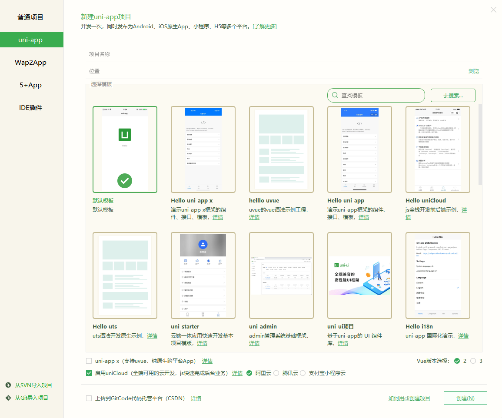
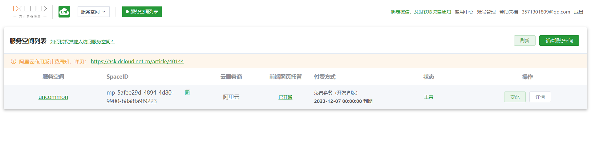
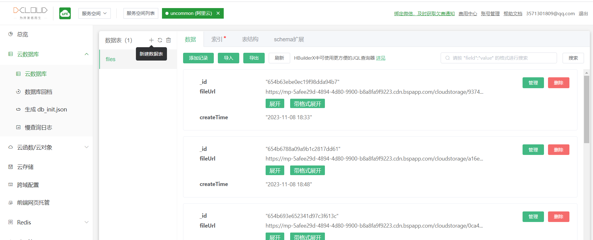
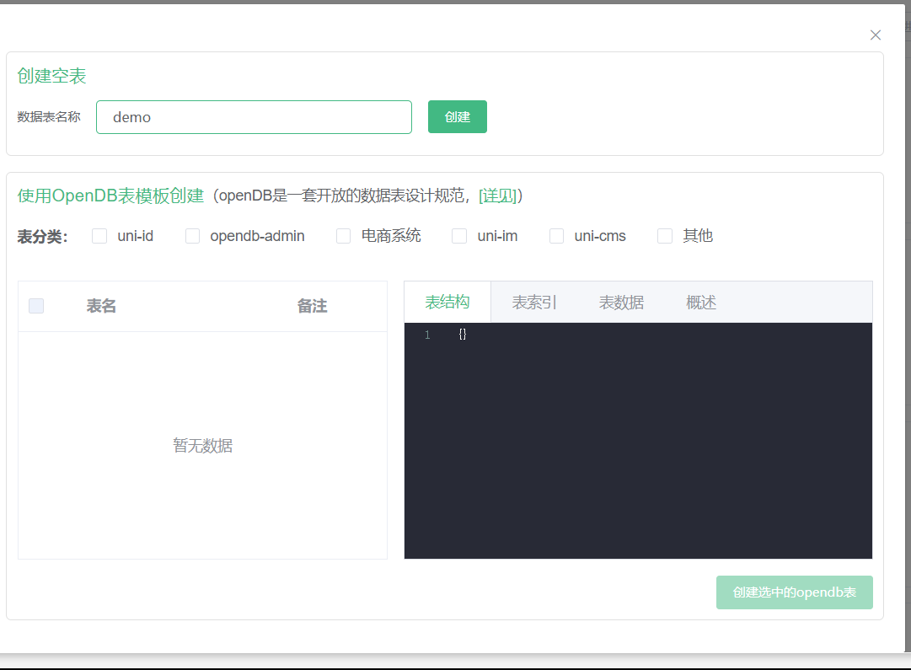
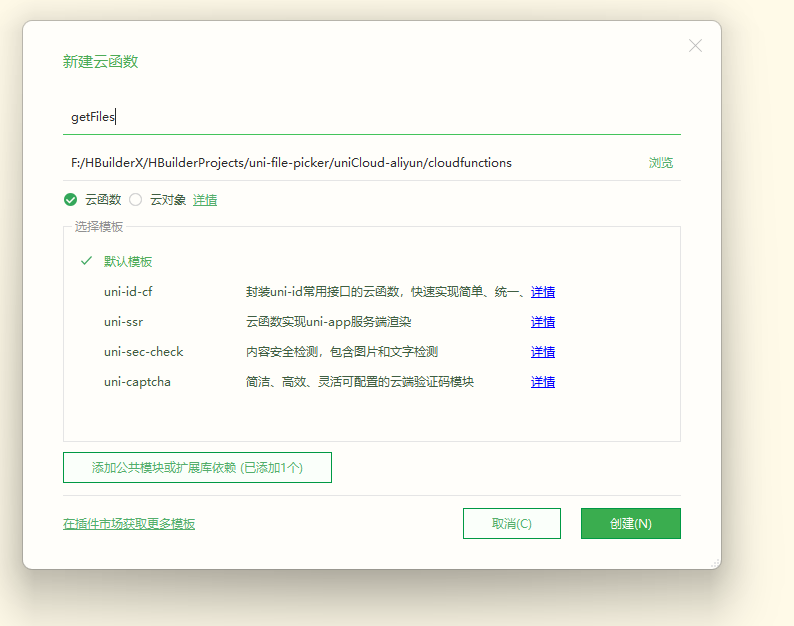
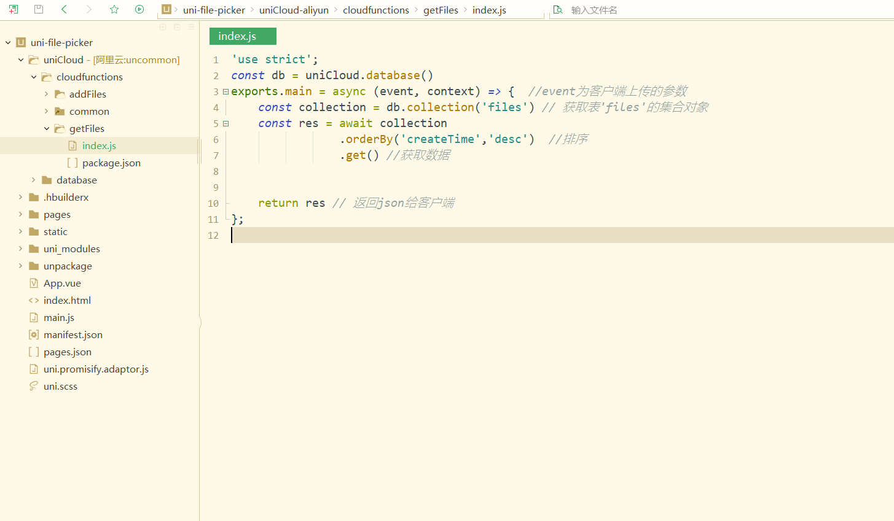
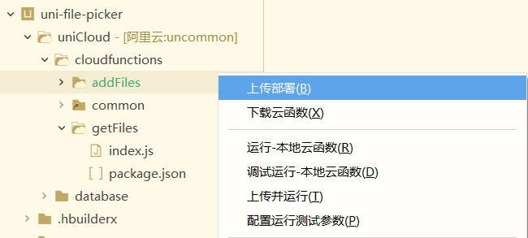
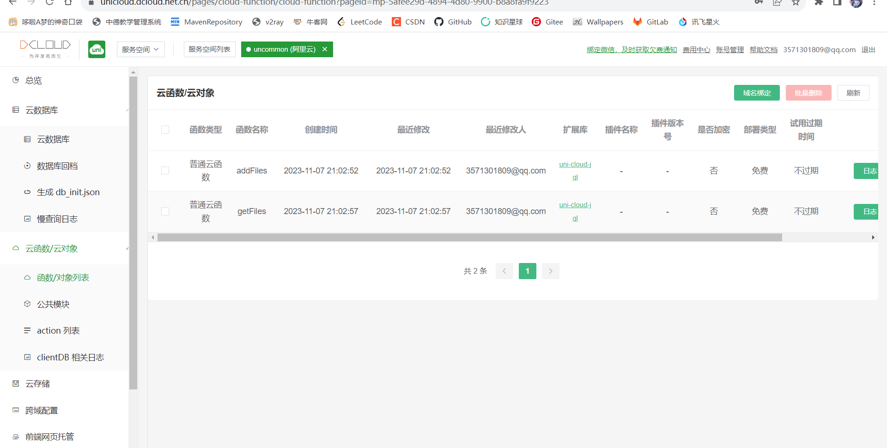
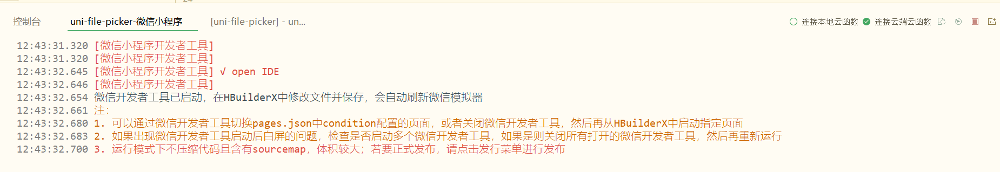
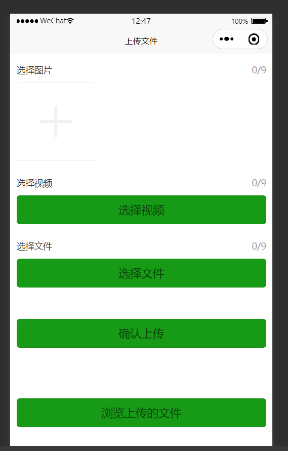

# 使用HBuilder将文件上传至云空间

> HBuilder版本：3.8.12.20230817

## uni-Cloud

1. 新建uni-app项目

   > 选择启用uniCloud，使用阿里云 , Vue2，默认模版

   

2. 初始化uniCLoud

   HBuilderX 会在项目创建后弹出 uniCloud初始化向导，根据向导部署**阿里云**服务空间

   - 按照法律要求，开通云服务器需实名认证，如未认证请根据提示完成

   - 创建一个服务空间，创建完成后回到向导刷新列表，选择这个服务空间（创建服务空间可能需要几十秒的时间，可以在web控制台查看是否创建完成。）

     

## 云函数

> 可以参考这篇博客 https://blog.csdn.net/weixin_38946164/article/details/110639049

1. 在uniCloud 的 web [控制台](https://unicloud.dcloud.net.cn/pages/overview/overview?pageid=mp-5afee29d-4894-4d80-9900-b8a8fa9f9223)选择你创建好的服务空间

   

2. 点击名称（如图为 uncommon）进入

3. 在云数据库中新建数据表

   

   直接创建空表

   

4. 在项目的*uniCloud.cloudfunction*目录下右键新建云函数

   

5. 起个名字后点击创建

   要分别创建**addFiles**和**getFiles**两个云函数

   

6. 在**addFiles.index.js**里写函数：

   > 注意将 files 改为自己的云数据库里的表名

   ````js
   'use strict';
   const db = uniCloud.database()
   exports.main = async (event, context) => {
   	const collection = db.collection('files') //云数据库里的表名 ，记录上传图片到云存储后返回的fileID
   	const res = await collection.add(event)  //event为客户端上传的参数
   	return res
   };
   
   ````

7. 在**getFiles.index.js**里写函数：

   >  注意将 files 改为自己的云数据库里的表名

   ````js
   'use strict';
   const db = uniCloud.database()
   exports.main = async (event, context) => {  //event为客户端上传的参数    
       const collection = db.collection('files') // 获取表'files'的集合对象
   	const res = await collection
   				.orderBy('createTime','desc')  //排序
   				.get() //获取数据
   
   	
       return res // 返回json给客户端
   };
   
   ````

   

8. 分别上传部署两个云函数

   

9. 而后可以在web控制台内看到上传的云函数

   

   

## 代码实现

**pages.index.inde.vue**

> 可以根据具体需要选择何种上传方式，不需要的上传方式直接删除其整个<uni-section>部分即可

````vue
<template>
	<view class="container">

		<uni-section title="只选择图片" type="line"> <!-- 标题栏组件  type:装饰类型 -->
			<view class="example-body">
				<!-- 文件上传组件  ref:用来给元素或子组件注册引用信息  limit:最大选择个数  
				   title:组件标题，右侧显示上传计数  source-type: album从相册选图，camera使用相机
					 auto-upload:是否自动上传  @success:上传成功事件  @fail:上传失败事件-->
				<uni-file-picker ref="images" limit="9" title="选择图片" :source-type="['album', 'camera']"
					:auto-upload="false" @success="success" @fail="fail">
				</uni-file-picker>
			</view>
		</uni-section>

		<uni-section title="只选择视频" type="line">
			<view class="example-body">
				<!-- file-mediatype:选择文件类型image/video/all 默认image-->
				<uni-file-picker ref="videos" limit="9" file-mediatype="video" title="选择视频"
					:source-type="['album', 'camera']" :auto-upload="false" @success="success" @fail="fail">
					<button class="button">选择视频</button>
				</uni-file-picker>
			</view>
		</uni-section>

		<uni-section title="从聊天记录选文件" type="line">
			<view class="example-body">
				<uni-file-picker ref="files" limit="9" file-mediatype="all" title="选择文件" :auto-upload="false"
					@success="success" @fail="fail">
					<button class="button">选择文件</button>
				</uni-file-picker>
			</view>
		</uni-section>

		<view style="padding: 40px 10px;">
			<!-- @click：点击事件 -->
			<button class="button" @click="upload">确认上传</button>
		</view>

		<view style="padding: 40px 10px;">
			<button class="button" @click="browse">浏览上传的文件</button>
		</view>

	</view>
</template>

<script>
	export default {
		data() {
			return {}
		},
		methods: {
			upload() { // 点击上传后调用的方法
				console.log('开始上传')
				this.$refs.files.upload() // 通过ref注册的引用信息来定位并上传
				this.$refs.videos.upload()
				this.$refs.images.upload()
			},
			success(res) { // 上传成功后调用的方法
				console.log('上传成功啦！' + res.tempFilePaths) //res.tempFilePaths：上传的文件地址对象

				//将当前日期格式化
				var date = new Date()
				var year = date.getFullYear()
				var month = date.getMonth() + 1 < 10 ?
					'0' + (date.getMonth() + 1) : date.getMonth() + 1
				var day = date.getDate() < 10 ? '0' + date.getDate() : date.getDate()
				var hours = date.getHours() < 10 ? '0' + date.getHours() : date.getHours()
				var minutes = date.getMinutes() < 10 ? '0' + date.getMinutes() : date.getMinutes()

				for (let i = 0; i < res.tempFilePaths.length; i++) { // 遍历文件列表以分别提交文件，以便每个文件都可以获取到唯一id
					uniCloud.callFunction({ // 调用云端函数，把文件写入云数据表
						name: 'addFiles', // 云函数名称
						data: { // 提交给云端的数据
							fileUrl: res.tempFilePaths[i], // 文件链接
							createTime: year + '-' + month + '-' + day + ' ' + hours + ':' + minutes //文件的提交时间
						},
						success: (res) => {
							console.log('数据插入成功' + res)
						},
						fail: (err) => {
							console.log('数据插入失败' + err)
						}
					})
				}
			},
			fail() { // 上传失败后调用的方法
				console.log('文件上传失败了！')
			},
			browse() { // 预览云端文件
				uni.navigateTo({ //  跳转到指定页面
					url: "./view",
				});
			}
		}
	}
</script>

<style lang="scss">
	.text {
		font-size: 14px;
		color: #333;
	}

	.example-body {
		padding: 10px;
	}

	.button {
		color: rgba(0, 0, 0, 0.6);
		background-color: #179b16;
		border-color: #000000;
	}
</style>
````

**pages.index.view.vue**

````vue
<template>
	<view>
		<view class="free-WaterfallFlow">
		  <block>
			  <!-- 遍历文件列表以展示出来 -->
			<view class="flex-wrap" v-for="(item,index) in imgList" :key="index">  
			 <!-- mode=宽度不变，高度自动变化，保持原图宽高比不变  src=图片资源地址   -->
				<image mode="widthFix" :src="item.fileUrl" :data-src="item.fileUrl" @click="clickimg" ></image>
				<view> {{item.createTime}} </view>
			</view>
		  </block>
		</view>
		<!--返回顶部-->
		<view class="top" :style="{'display':(flag===true? 'block':'none')}">
            <!-- src="../../static/top.png"  需要在该路径下放一张图片 用于表示‘回到顶部’ -->
			<image class="topc" @click="top" src="../../static/top.png" ></image>
		</view>
	</view>
</template>

<script>

	export default {
		data() {
			return {				
				imgList: [],				
				flag: false
			}
		},
		
		onLoad() {
			uni.showLoading({
				title: '查询中...'
			})
			uniCloud.callFunction({  //调用云函数
				name:'getFiles',  //云函数名称
				success: res => {
					this.imgList = res.result.data //云端返回的数据
				},
				fail(e) {
					console.log(e)
				},
				complete: () => {
					uni.hideLoading()
				}	
			})
		},
		
		methods: {	
			// 图片预览
			clickimg(event) {
				var imgurl = event.currentTarget.dataset.src
				var currentUrl = event.currentTarget.dataset.src   //获取点击图片的地址, **对应<template>里面的 :data-src="item.src"					
				uni.previewImage({       
					urls: [imgurl],    //这里是单图 . 需要预览的全部图片地址,这个数组是必须的,要用[] 					
					current: currentUrl, //当前显示图片的地址					
				})  
			},
			
			//回到顶部
			top() { 
				uni.pageScrollTo({
					scrollTop: 0,
					duration: 300
				});
			},
			onPageScroll(e) { //根据距离顶部距离是否显示回到顶部按钮
				if(e.scrollTop>600){ //当距离大于600时显示回到顶部按钮
					this.flag=true
				}else{ //当距离小于600时隐藏回到顶部按钮
					this.flag=false
				}
			}

		}
	}
</script>

<style>
	.free-WaterfallFlow{
		width:96%;
		column-count:2; /* 分隔的列数 */
	}
	.free-WaterfallFlow .flex-wrap{
		display: inline-block;
		width:98%;
		margin-left:3%;
		margin-bottom:3%;		
		padding:2%;
		padding-top:5%;	
		border:0px solid #cc22b0; /* 边框 */
		box-shadow: 0 2px 2px rgba(34, 25, 25, 0.4); /* 框阴影 */
		text-align: center; /* 框内元素居中对齐 */
	}
	.flex-wrap image{
		width:95%;
		margin:0 auto;
	}
	
	/* 回到顶部 */
	.top {
		position: relative;
		display: none; /* 先将元素隐藏 */
	} 
	.topc {
		height: 30px; 
		width: 30px;
		position: fixed;
		right: 5px;
		top: 80%;
	}
</style>


````

新页面需要添加在**pages.json**里:

```json
{
	"pages": [ //pages数组中第一项表示应用启动页
		{
			"path": "pages/index/index",
			"style": {
				"navigationBarTitleText": "上传文件"
			}
		},
		{
			"path": "pages/index/view",
			"style": {
				"navigationBarTitleText": "预览文件"
			}
		}
	],
	"globalStyle": {
		"navigationBarTextStyle": "black",
		"navigationBarTitleText": "uni-app",
		"navigationBarBackgroundColor": "#F8F8F8",
		"backgroundColor": "#F8F8F8"
	},
	"uniIdRouter": {}
}

```


## 启动！

> 注意右上方的选择连接本地云函数还是云端云函数
>
> 本地云函数一般是云函数的开发版
>
> 云端云函数一般是云函数的发行版
>
> 在我们这里当然都一样啦，选哪个都行





> 只有图片可以预览，其它文件都显示空白
>
> 仅用于说明可以从云端拿回上传的文件


