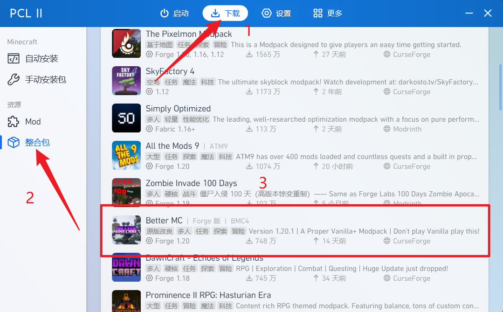
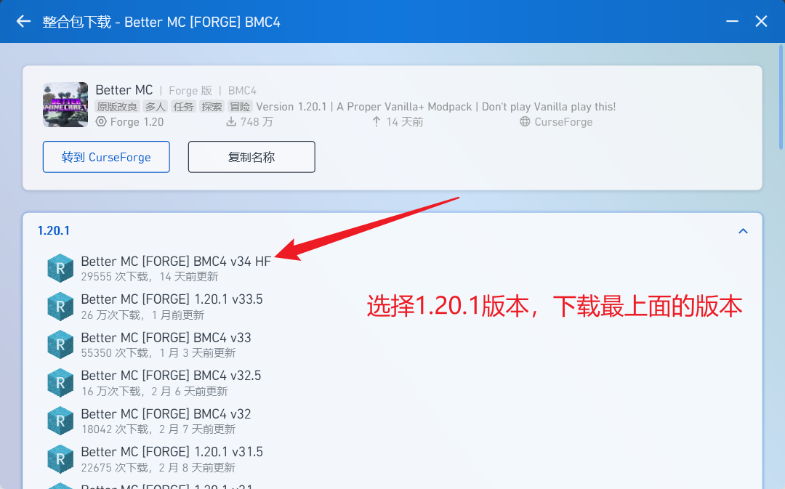
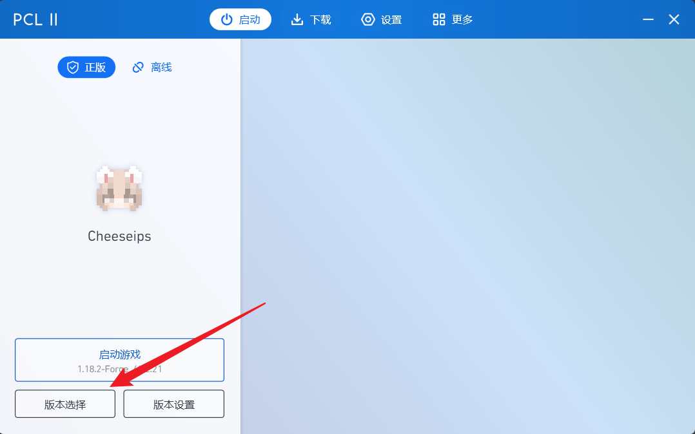
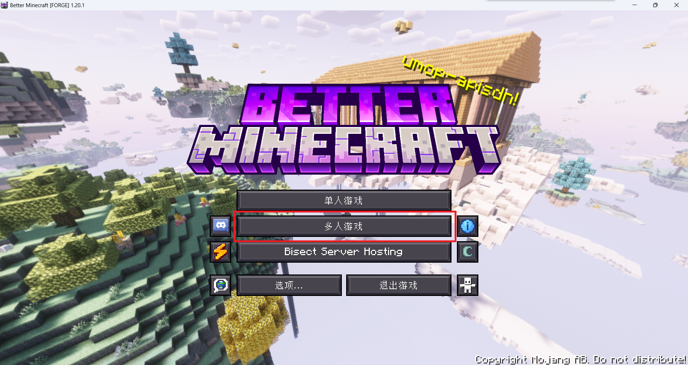
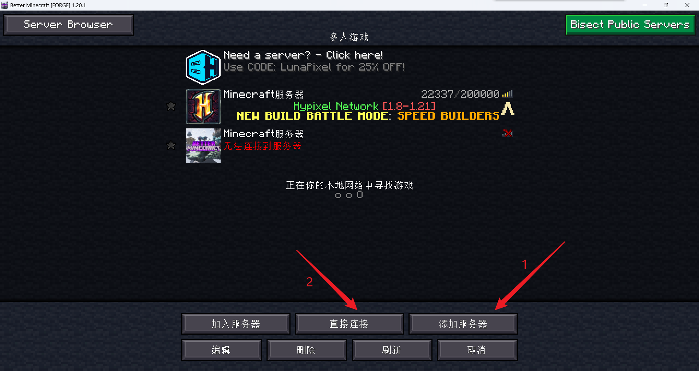
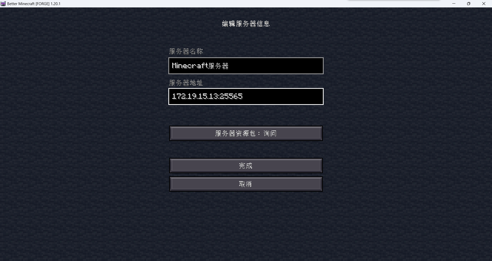

# 如何游玩社团Minecraft服务器

### 下载Minecraft启动器

这边推荐三个游戏启动器

1. 官方启动器（可能需要魔法才能进入）：仅支持正版登录，需要购买正版，而且价格比较高

   [下载 Minecraft 及服务器软件 | Minecraft](https://www.minecraft.net/zh-hans/download)

2. PCL II：这是国人大佬龙腾猫跃老师开发的非官方启动器，颇受好评，支持正版和离线登录。

   [PCL 最新正式版永久下载丨龙腾猫跃丨爱发电](https://afdian.com/p/0164034c016c11ebafcb52540025c377)

3. HCML：这是国内大佬huanghongxun老师开发的非官方启动器，同样颇受好评，支持正版和离线登录。

   [Hello Minecraft! Launcher](https://hmcl.huangyuhui.net/)

每种启动的风格不同，可以都下载试试。

### 下载服务器所需整合包

在原版Minecraft的基础上，如果想体验更多玩法，可以通过添加Mod的形式（Mod可以理解为插件，但又不是插件）

而将多个且大量的Mod整合在一起，就叫做整合包

社团MC服务器并非原版服务器，而是装载了一个拥有三百多个Mod的大型整合包

而由于MC的设计特点，如果连接带有Mod的服务器，需要本地游戏内装载有数量完全相同，版本完全相同的Mod才可以加入

所以这边提供整合包的下载地址：

- 一个是基于CurseForge网站提供的官方下载地址：（可能需要魔法，且下载很慢）[CurseForge](https://www.curseforge.com/minecraft/modpacks/better-mc-forge-bmc4/files/5854101)

- 另一个是基于非官方启动器的整合包下载界面：（我这里以PCL II为例）

- 还有一个是基于社团存储服务器下载：（需要在校园网环境下操作）[社团Alist存储服务器](http://172.19.15.13:5244/d/root/Resource/JavaSIG/Better%20MC%20%5BFORGE%5D%20BMC4%20v34%20HF.zip?sign=EcFL0BsYArvXz1DWhqusq84e7Q0vgsoJggZqfMgMCKA=:0)

更推荐使用非官方启动器自带的下载界面下载，因为会自动帮你处理，处理完毕之后点击开始游戏即可

当然其他的方法也就多操作几步而已。

### 装载整合包

如果你是基于上述第一个和第三个下载方式进行的话，需要看这一部分

基于第二个下载方式的话，就可以直接跳过到下一部分了

下载好之后，应该是一个.zip压缩包文件，咱们不需要解压它，直接使用启动器对其进行操作

这里以PCL II为例：

1. 在启动界面，点击左下角的版本选择

2. 点击`导入整合包`，在弹出的选择界面里找到下载文件的目录，点击确定
3. 等待启动器处理下载完毕后即可

### 加入服务器

在启动游戏之前，一定确保启动的是下载的整合包，名称为**Better MC[FORGE] BMC4**，且游戏版本为**1.20.1**，Forge版本为**47.3.11**

确认完毕之后点击启动游戏，等待进入游戏界面，如下图

进入游戏之后，点击`多人游戏`，在下方选择栏内，点击`添加服务器`，在新的界面中输入**172.19.15.13:25565**，所有标点一定要是英文字符，否则会报错而无法进入游戏

也可以点击`直接连接`，同样输入172.19.15.13:25565来进入游戏，只不过不会保存服务器，需要每次都点击和输入

等待游戏加载完毕后就可以游玩啦~

