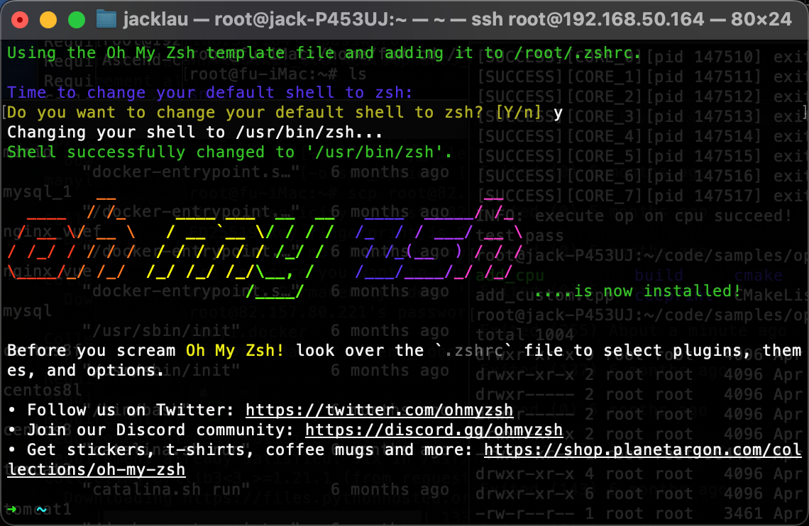

# oh my zsh 配置

下载zsh
```
apt install zsh 
```

```
sh -c "$(wget -O- https://raw.githubusercontent.com/ohmyzsh/ohmyzsh/master/tools/install.sh)"
```
看到以下标志即表明安装成功


换一个主题
```
git clone --depth=1 https://gitee.com/romkatv/powerlevel10k.git ${ZSH_CUSTOM:-$HOME/.oh-my-zsh/custom}/themes/powerlevel10k
```

添加 `ZSH_THEME="powerlevel10k/powerlevel10k"` 到 `~/.zshrc`
