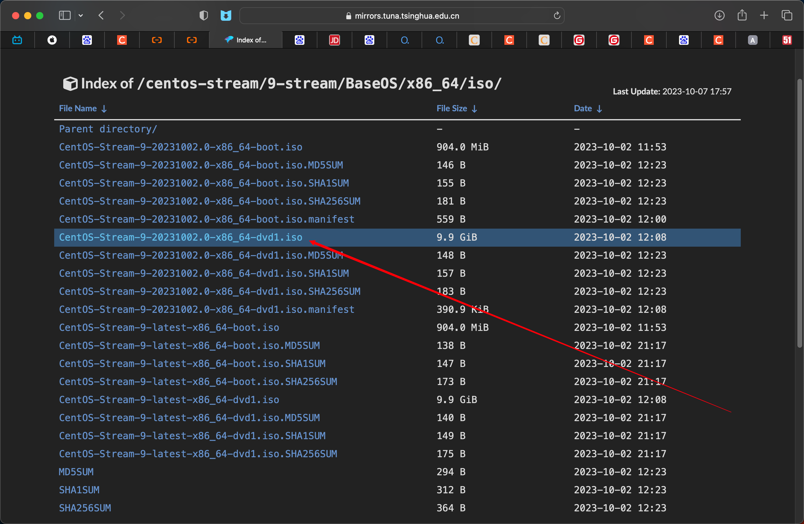
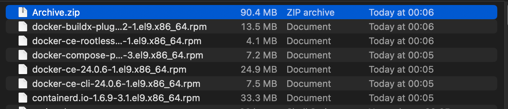
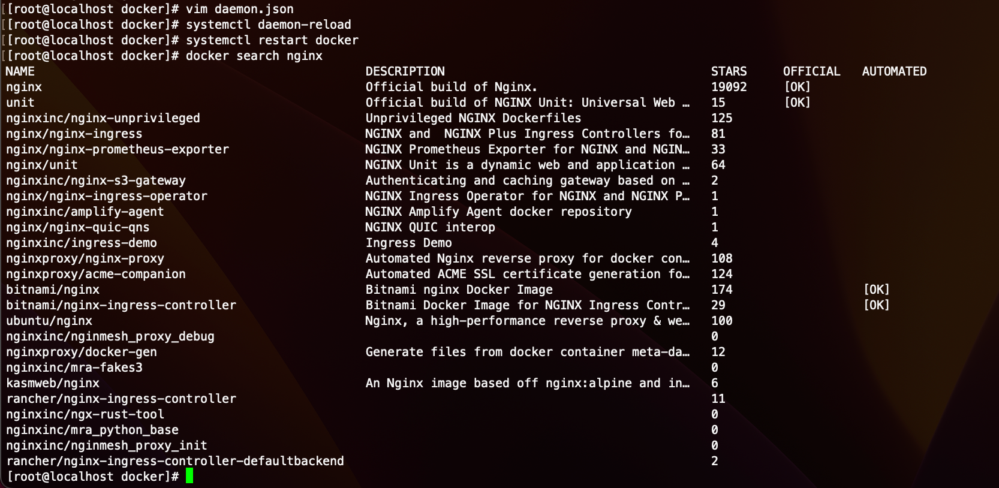
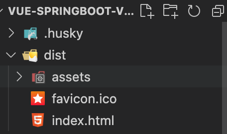
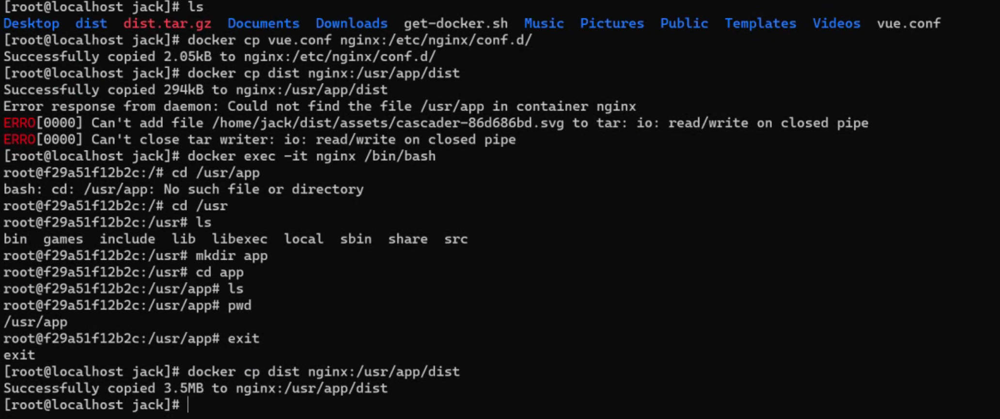
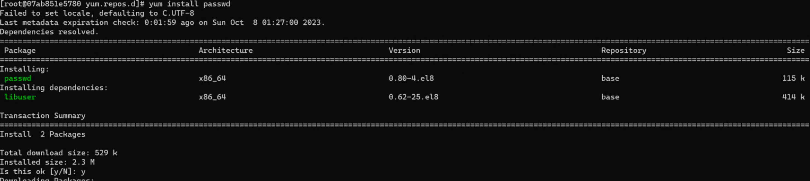
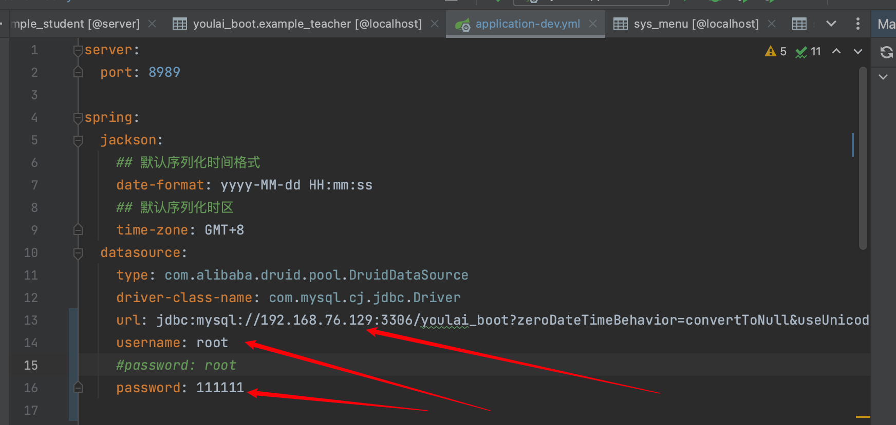
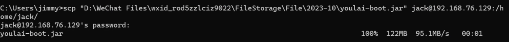
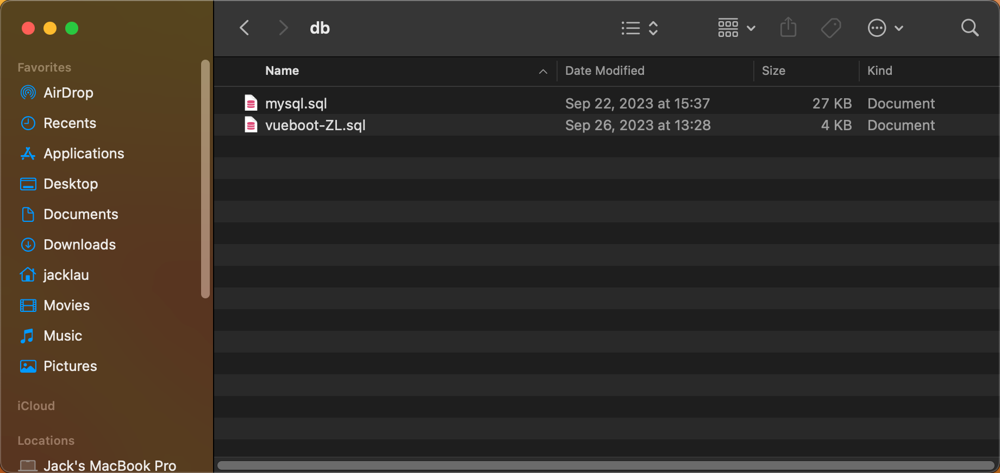

# CentOS Stream 9 使用Docker部署项目

## 准备
### 下载CentOS Stream 9镜像

官网服务器在境外 ，访问缓慢可以使用清华镜像


[官网](https://www.centos.org/centos-stream/#download)

[清华镜像](https://mirrors.tuna.tsinghua.edu.cn/centos-stream/9-stream/BaseOS/x86_64/iso/)


centos安装到本地虚拟机可以使用[VMWare Worksation Player](https://www.vmware.com/products/workstation-player.html)

进入VMWare软件，新建虚拟机，参数默认即可，后期可以根据需求调整。


由于CentOS包管理器yum的下载服务器在境外，比较慢 可以进行换源 
```
mkdir /etc/yum.repos.d/backup

cp /etc/yum.repos.d/*.repo /etc/yum.repos.d/backup/

sed -i 's|metalink|#metalink|g' /etc/yum.repos.d/*.repo

sed -i '/name=CentOS Stream $releasever - BaseOS/a baseurl=https://mirrors.aliyun.com/centos-stream/$stream/BaseOS/$basearch/os/' /etc/yum.repos.d/*.repo

sed -i '/name=CentOS Stream $releasever - AppStream/a baseurl=https://mirrors.aliyun.com/centos-stream/$stream/AppStream/$basearch/os/' /etc/yum.repos.d/*.repo

sed -i '/name=CentOS Stream $releasever - Extras packages/a baseurl=https://mirrors.aliyun.com/centos-stream/SIGs/$stream/extras/$basearch/extras-common/' /etc/yum.repos.d/*.repo

yum clean all

yum makecache

yum update
```
安装一些必要的依赖
```
yum install -y yum-utils device-mapper-persistent-data lvm2
```

## 下载docker

### 添加docker仓库
```
sudo yum-config-manager --add-repo https://download.docker.com/linux/centos/docker-ce.repo
```
### 下载docker
```
sudo yum install docker-ce docker-ce-cli containerd.io docker-compose-plugin
```
* 笔者这里遇到下载缓慢，失败的情况，于是在本机手动下载rpm，上传至centos，手动安装

[rpm下载地址](https://download.docker.com/linux/centos/9/x86_64/stable/Packages/)

下载各个组件最新版本即可 

将所有rpm打包 可以使用scp命令进行上传
```
scp Archive.zip jack@192.168.31.86:/home/jack/Documents
```


在centos解压包
```
unzip Archive.zip 
```


手动安装
```
sudo yum install *.rpm
```

启动服务
```
sudo systemctl start docker
```
查看版本
```
docker version
```
验证docker引擎
```
sudo docker run hello-world
```
设置开机自启动
```
systemctl enable docker
```
### docker仓库镜像加速
cd到/etc/docker/目录下 创建daemon.json文件
```
cd /etc/docker/

```

使用vim写入``{ "registry-mirrors": ["https://bb6s1gkq.mirror.aliyuncs.com"] }``


## 制作容器

* 由于示例作用，本项目将前端 后端 数据库分别部署到不同容器，也就是需要三个容器

### 前端nginx容器制作
```
docker pull nginx
docker run -d -p 80:80 --name nginx nginx
```

下载网络工具
```
sudo yum install net-tools
```
查看centos所在ip
```
ifconfig
```

将ip地址输入至浏览器


打包vue前端项目 找到``.env.production``文件 修改``VITE_APP_BASE_API``为虚拟机的ip地址加后端留出的端口


在vue项目目录下打开terminal 输入命名 打包程序
```
npm run build:prod
```
打包成功后 html代码会生成在项目根目录下的dist目录

重新开一个terminal 可以将dist目录打包上传至虚拟机，在此笔者就演示scp命令


在虚拟机里写好一个配置文件
```
cd ~
touch vue.conf 
vim vue.conf
```
编辑vue.conf 输入以下内容

将此配置文件复制进nginx容器内 具体参考图片内的命令。然后复制dist目录，发现没有app目录，于是进入容器创建此目录


访问centos ip 发现页面没有更换 于是重启下nginx容器
```
docker stop nginx 
docker start nginx
```
网页成功加载，由于后端服务未部署，所以无法进入后台


### 后端centos容器制作

```
docker pull centos:8
dokcer run -itd --name centosv8 centos:8 
docker exec -it centosv8 /bin/bash
```
对此centos8容器进行yum换源
```
cd /etc/yum.repos.d/ && mkdir backup && mv *repo backup/
curl -o /etc/yum.repos.d/CentOS-Base.repo http://mirrors.aliyun.com/repo/Centos-8.repo
sed -i -e "s|mirrors.cloud.aliyuncs.com|mirrors.aliyun.com|g " /etc/yum.repos.d/CentOS-*
sed -i -e "s|releasever|releasever-stream|g" /etc/yum.repos.d/CentOS-*
yum clean all && yum makecache
```
下载passwd成功 证明换源成功

设置密码
```
passwd root
```
安装一些组件
```
yum install -y unzip zip vim lrzsz wget initscripts
```
安装完后输入``exit``退出容器,基于此容器制作新镜像来进一步配置端口映射以及java运行环境
```
docker commit centosv8 centosv8l
docker run -itd -p 8989:8989 --name centos centosv8l 
docker exec -it centos /bin/bash
yum install -y java-17
```
打包后端java项目 打包前需要修改mysql的ip地址为centos的，用户名和密码自定义 但需要和稍后制作的mysql容器保持一致

点击IDEA右侧的Maven项目管理工具，点击package一键打包

在项目目录下的targets目录找到jar包 上传至centos


复制此jar进centos容器内 并运行
```
docker cp youolai-boot.jar centos:/root
docker exec -it centos /bin/bash
nohup java -jar youlai-boot.jar
```
### 数据库mysql容器制作
```
docker pull mysql
docker run --name mysql -p 3306:3306 -e MYSQL_ROOT_PASSWORD=111111 -d mysql
```
将项目sql脚本上传


将脚本复制进mysql容器并运行


访问网页 成功登入 前 后 数据库已成功连接


### minio容器制作
创建minio容器
```
docker run -dit -p 9000:9000 -p 50000:50000 --restart=always -v /home/ainoeliya/app/minio/data/data-1:/data-1 -v /home/ainoeliya/app/minio/data/data-2:/data-2 -v /home/ainoeliya/app/minio/data/data-3:/data-3 -v /home/ainoeliya/app/minio/data/data-4:/data-4 -v /home/ainoeliya/app/minio/data/data-5:/data-5 -v /home/ainoeliya/app/minio/data/data-6:/data-6 -v /home/ainoeliya/app/minio/data/data-7:/data-7 -v /home/ainoeliya/app/minio/data/data-8:/data-8 -e "MINIO_ROOT_USER=admin" -e "MINIO_ROOT_PASSWORD=12345678" --name minio --privileged=true minio/minio server /data-{1...8} --console-address ":50000"
```

### 网络桥接
由于业务需求，minio容器和后端centos容器在同一个局域网下
于是创建一个docker网络
```
docker network create my-net
```
对两个容器进行桥接
```
docker network connect my-net 6aa
docker network connect my-net 95b
```

## 总结

本次示例分别使用nginx，centos，mysql三个容器来运行前端，后端，数据库服务，仅仅是为了让大家熟悉一下java项目的组成以及docker的使用

docker的作用就是可以快速打包容器为镜像，服务部署一次，可以直接拿镜像在其他机器上快速运行，熟悉掌握docker也会大大减少linux开发人员配置环境的繁琐步骤


